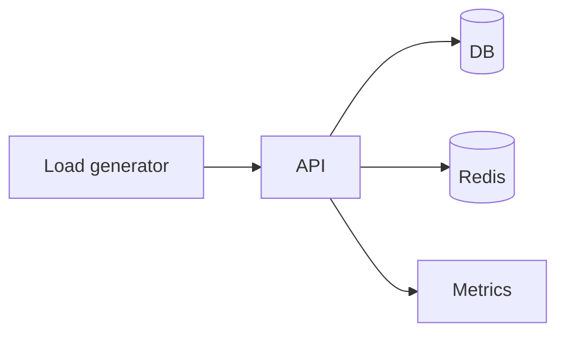

# Load Testing

## Complete notes

Load testing checks how system behaves under expected and peak traffic.

## Easy explanation

Load testing checks how system behaves under expected and peak traffic.

In simple words: if you can explain `Load Testing` with one real request, one failure case, and one metric, you understand the topic much better than just memorizing the definition.

## Simple example

Think of proving the system works before users find bugs. This topic explains which tests catch which risks and where they belong in CI/CD.

For `Load Testing`, ask yourself:

1. What is the normal happy path?
2. What can fail?
3. What is the tradeoff?
4. What would I monitor in production?

## Real-life examples

### Easy real-life example

You write a unit test to check that a function calculates price correctly.

### Difficult production example

A payment platform uses unit, integration, contract, E2E, load, and chaos tests with realistic test data, deterministic CI, and failure-mode validation.

### How to relate this topic

When reading `Load Testing`, connect it to:

- one user action
- one backend component
- one failure case
- one tradeoff
- one metric

## Important points

- Core idea: `Load Testing` must be understood through its production use case, not just its definition.
- When to use it: Focus on test pyramid, unit/integration/contract/E2E/load/chaos tests, test data, deterministic fixtures, CI gates, and failure injection.
- At scale: explain the bottleneck, failure path, operational owner, and rollback/fallback.
- What to monitor: test pass rate, flake rate, CI duration, escaped defects, coverage of critical flows, and rollback-causing bugs.
- Interview rule: always give one concrete example, one tradeoff, one failure mode, and one metric.

## Diagram

## SDE-3 interview angle

At SDE-3 level, do not only define this topic. Explain tradeoffs, failure modes, production debugging signals, and what you would choose under different requirements.

## Common mistakes

- Too many brittle E2E tests and too few useful integration/contract tests.
- No failure-mode tests.
- Flaky tests ignored.
- Mocks that do not match real service contracts.
- No realistic test data.

## Quick revision

Load testing checks how system behaves under expected and peak traffic.

## Deep understanding checklist

To fully understand `Load Testing`, be able to answer:

1. Where does it sit in the architecture?
2. What production problem does it solve?
3. What is the simplest implementation?
4. What breaks when traffic or data grows?
5. What is the main failure mode?
6. What tradeoff does it introduce?
7. Which metric proves it is healthy?

Strong answer focus: Focus on test pyramid, unit/integration/contract/E2E/load/chaos tests, test data, deterministic fixtures, CI gates, and failure injection.

## Production example and edge cases

Example: for checkout, unit-test price logic, integration-test database/payment adapter, contract-test provider payloads, E2E-test the happy path, load-test peak checkout, and failure-test provider timeout/idempotency.

For `Load Testing`, the edge cases to always think about are:

- duplicate request or duplicate event
- dependency timeout or partial failure
- stale data or inconsistent state
- bad input or abusive client
- high traffic causing bottleneck
- rollback or replay after a bad deploy

Interview answer rule: after explaining the concept, immediately give one production example, one failure mode, one tradeoff, and one metric.

## Senior interview bank

These are topic-specific questions and strong answers for `Load Testing`.

### 1. Which tests belong here?

Use unit tests for logic, integration tests for real dependencies, contract tests for service boundaries, E2E for critical user journeys, load tests for capacity, and chaos tests for resilience.

### 2. What should run on every PR?

Fast unit tests, core integration tests, lint/type checks, and contract tests. Slow E2E/load/chaos tests can run nightly or before major releases.

### 3. How do you test failure?

Inject timeouts, dependency 5xx, duplicate messages, slow DB, queue backlog, network errors, and bad payloads. Verify retry, DLQ, idempotency, and fallback behavior.

### 4. How do you avoid flaky tests?

Control time, isolate state, avoid sleeps, use deterministic data, mock only at stable boundaries, and quarantine/fix flaky tests quickly.

### 5. What is the senior-level answer?

Test the behavior that would hurt users or money first. Coverage percentage matters less than confidence in critical flows and failure paths.

## Topic-specific drill

### How would I answer `Load Testing` if the interviewer asks directly?

For `Load Testing`, I would explain which failures the test catches, where it runs in CI/CD, how it avoids flakiness, and what production risk it reduces.

### What is the trap question for `Load Testing`?

The trap is giving only a definition. A senior answer must include a concrete production example, a failure mode, a tradeoff, and a metric.

### What should I draw?

Draw the smallest flow that shows where `Load Testing` sits, then add the failure path next to the happy path.

## Reviewer checklist

- Can I explain this without reading the note?
- Can I draw the happy path and failure path?
- Can I name one concrete metric?
- Can I explain the tradeoff against a simpler option?
- Can I give a production example in under two minutes?
