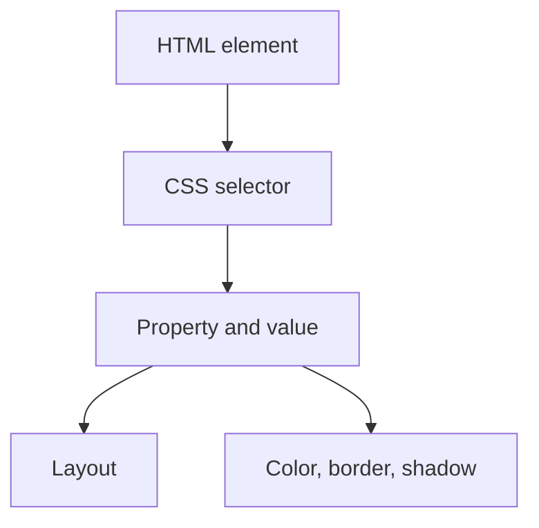

## ID

so we can give a tag a id this is a unique way to identify a tag
body id="test"
and to access  it we user .
so example
.id{
color:red
}

## Complete notes

Class and ID are used to select HTML elements in CSS and JavaScript.

## ID

An ID should be unique on the page.

```html

<div id="hero"></div>

```

```css

# hero {
  color: red;
}

```

## Class

A class can be reused on many elements.

```html

<button class="btn"></button>

```

```css

.btn {
  padding: 8px;
}

```

## Main difference

- Use `id` for one special element.
- Use `class` for repeated styling.

## Revision notes

### What it is

Class and ID selectors connect CSS rules to HTML elements.

### Why it matters

- It helps you understand the main job of `CLASS ID`.
- It gives a mental model for interviews, revision, and building real projects.
- It connects with nearby notes in this vault, so revise it with the content table and related links.

### How to think about it

Ask these questions:

- What problem does it solve?
- What are the main parts?
- What happens step by step?
- Where is it used in real projects?
- What mistake should I avoid?

### Diagram



### Key terms

`class`, `id`, `selector`, `specificity`, `reuse`

### Real project example

In a real app, `CLASS ID` is not learned alone. It connects with frontend, backend, database, browser, network, and deployment decisions.

Example revision flow:

1. Define the topic in one sentence.
2. Draw the flow from memory.
3. Explain one real use case.
4. Say one advantage.
5. Say one limitation or mistake.

### Common mistakes

- Memorizing the word but not knowing the flow.
- Not knowing when to use it.
- Mixing similar topics without comparing them.
- Forgetting the tradeoff.

### Quick revision

- Main idea: Class and ID selectors connect CSS rules to HTML elements.
- Remember the keywords: class, id, selector, specificity.
- Best way to revise: explain it out loud with a small example and the diagram.
