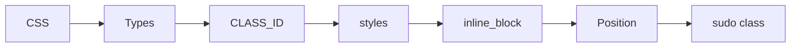

# CSS CONENT

- types of CSS [[Types]]
- ID and class[[CLASS_ID]]
- some css style example[[styles]]
- inline block[[inline_block]]
- position[[Position]]
- sudo class[[sudo class]]
- shadows[[shadows]]
- Grid[[grid]]
- Flex [[flex]]

## Complete notes

CSS topic map:

- [[Types]] explains ways to add CSS.
- [[CLASS_ID]] explains selectors.
- [[styles]] explains common style properties.
- [[inline_block]] explains display behavior.
- [[Position]] explains layout position.
- [[sudo class]] explains pseudo-classes.
- [[shadows]] explains visual shadow effects.
- [[grid]] and [[flex]] explain layout systems.

## Must know

- CSS selects HTML and applies styles.
- Class is reusable.
- ID is unique.
- Flex is mostly one-dimensional layout.
- Grid is two-dimensional layout.

## Revision dashboard

### Main idea

CSS controls how HTML looks and how layout behaves.

### Study order

- [[Types]]
- [[CLASS_ID]]
- [[styles]]
- [[inline_block]]
- [[Position]]
- [[sudo class]]
- [[shadows]]
- [[grid]]
- [[flex]]

### Diagram

### How to revise this folder

1. Open this content table first.
2. Click each linked topic one by one.
3. Read the `Complete notes` and `Revision notes` sections.
4. Redraw the diagram from memory.
5. Explain one real example without looking.

### Revision checklist

- I can define CSS in one sentence.
- I can explain each linked note.
- I can draw the topic flow.
- I know one use case.
- I know one common mistake.
