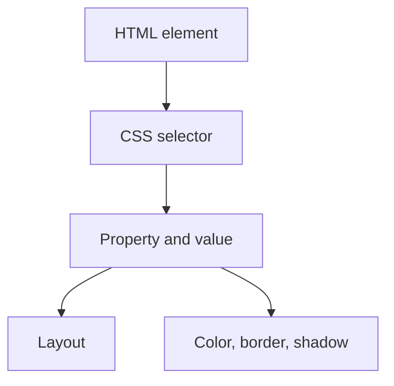

- Fixed
- absolute
- static
- relative
- sticky

## static

so when so this make the make the thing sticky to a fixed place

![[Pasted image 20260802013900.png|252]]

## relative

so this make the image free to move any where

![[Pasted image 20260802014219.png|273]]

![[Pasted image 20260802014231.png|298]]

## absolute

so this is ghost type thing

![[Pasted image 20260802014821.png|181]]

![[Pasted image 20260802014840.png|113]]

so here the top means it is based on the root thing

as it as no direct parent

![[Pasted image 20260802015034.png|301]]

so here the box 2 inside of box 1
so here the box 1 i html code is also inside the box 1 so this is the final result here

## fixed

so where ever we move it will be always be there so this

## sticky

so it will stick to a place and where we code it will not follow if we scroll then it will not coe it stick to a part

## Revision notes

### What it is

CSS position controls how an element is placed in normal flow or outside it.

### Why it matters

- It helps you understand the main job of `Position`.
- It gives a mental model for interviews, revision, and building real projects.
- It connects with nearby notes in this vault, so revise it with the content table and related links.

### How to think about it

Ask these questions:

- What problem does it solve?
- What are the main parts?
- What happens step by step?
- Where is it used in real projects?
- What mistake should I avoid?

### Diagram

### Key terms

`static`, `relative`, `absolute`, `fixed`, `sticky`, `z-index`

### Real project example

In a real app, `Position` is not learned alone. It connects with frontend, backend, database, browser, network, and deployment decisions.

Example revision flow:

1. Define the topic in one sentence.
2. Draw the flow from memory.
3. Explain one real use case.
4. Say one advantage.
5. Say one limitation or mistake.

### Common mistakes

- Memorizing the word but not knowing the flow.
- Not knowing when to use it.
- Mixing similar topics without comparing them.
- Forgetting the tradeoff.

### Quick revision

- Main idea: CSS position controls how an element is placed in normal flow or outside it.
- Remember the keywords: static, relative, absolute, fixed.
- Best way to revise: explain it out loud with a small example and the diagram.
