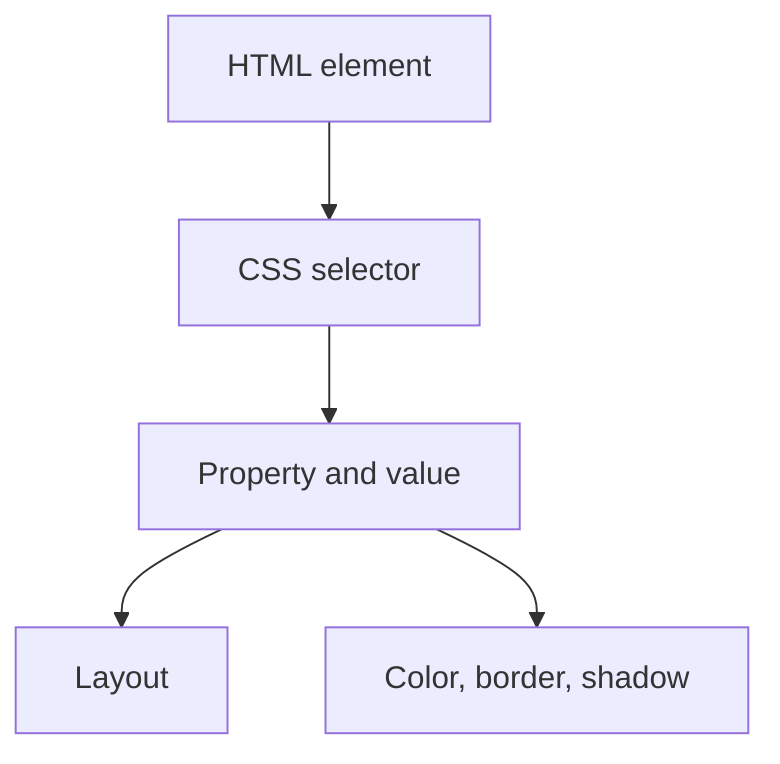

3 type of css property

- inline
- external
- internal

###  Inline

in the  body tag tag that is applied so this is applied here

### Internal

so we can use the internal where we there re many things and we need one common style
style
body{
backdroung-col:red;
}
style

### External

so here we will keep a different css class so we can use that
so to link it we use

## Revision notes

### What it is

CSS can be added inline, internally, or externally.

### Why it matters

- It helps you understand the main job of `Types`.
- It gives a mental model for interviews, revision, and building real projects.
- It connects with nearby notes in this vault, so revise it with the content table and related links.

### How to think about it

Ask these questions:

- What problem does it solve?
- What are the main parts?
- What happens step by step?
- Where is it used in real projects?
- What mistake should I avoid?

### Diagram

### Key terms

`inline CSS`, `style tag`, `external stylesheet`, `cascade`

### Real project example

In a real app, `Types` is not learned alone. It connects with frontend, backend, database, browser, network, and deployment decisions.

Example revision flow:

1. Define the topic in one sentence.
2. Draw the flow from memory.
3. Explain one real use case.
4. Say one advantage.
5. Say one limitation or mistake.

### Common mistakes

- Memorizing the word but not knowing the flow.
- Not knowing when to use it.
- Mixing similar topics without comparing them.
- Forgetting the tradeoff.

### Quick revision

- Main idea: CSS can be added inline, internally, or externally.
- Remember the keywords: inline CSS, style tag, external stylesheet, cascade.
- Best way to revise: explain it out loud with a small example and the diagram.
