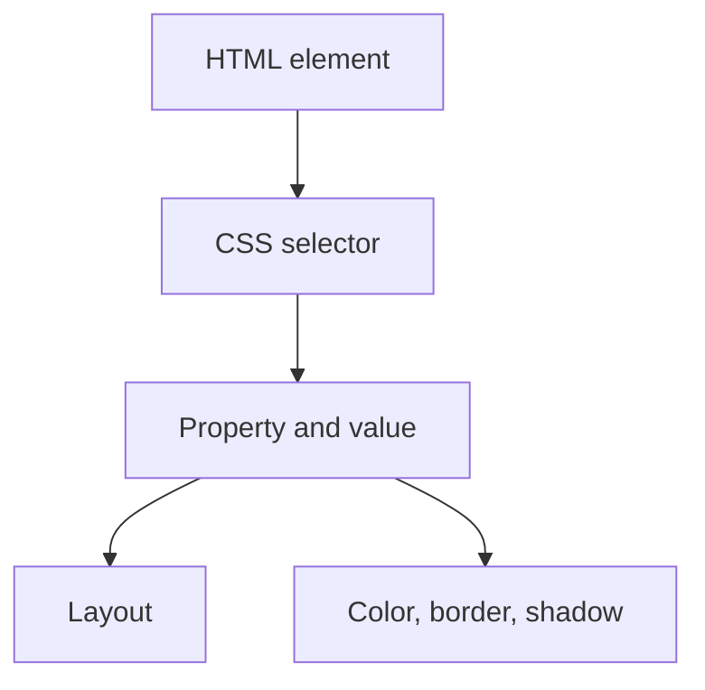

display :flex

## justify

so this is justify-content

![[Pasted image 20260802033551.png|480]]

justify content :space around
add space between  each bock

## align

o align item in y axis

![[Pasted image 20260802033711.png|486]]

flex-direction
so its default direction is row
so we can set it to column
then we ill have to use the property of the align item to do the operations

flex-wrap
so it wrap the content when size is reduced

## align -content

![[Pasted image 20260802034151.png|472]]

## Revision notes

### What it is

Flexbox is a one-dimensional layout system for rows or columns.

### Why it matters

- It helps you understand the main job of `flex`.
- It gives a mental model for interviews, revision, and building real projects.
- It connects with nearby notes in this vault, so revise it with the content table and related links.

### How to think about it

Ask these questions:

- What problem does it solve?
- What are the main parts?
- What happens step by step?
- Where is it used in real projects?
- What mistake should I avoid?

### Diagram

### Key terms

`[[Docker_Image_Container|container]]`, `item`, `main axis`, `cross axis`, `justify-content`, `align-items`

### Real project example

In a real app, `flex` is not learned alone. It connects with frontend, backend, database, browser, network, and deployment decisions.

Example revision flow:

1. Define the topic in one sentence.
2. Draw the flow from memory.
3. Explain one real use case.
4. Say one advantage.
5. Say one limitation or mistake.

### Common mistakes

- Memorizing the word but not knowing the flow.
- Not knowing when to use it.
- Mixing similar topics without comparing them.
- Forgetting the tradeoff.

### Quick revision

- Main idea: Flexbox is a one-dimensional layout system for rows or columns.
- Remember the keywords: container, item, main axis, cross axis.
- Best way to revise: explain it out loud with a small example and the diagram.
