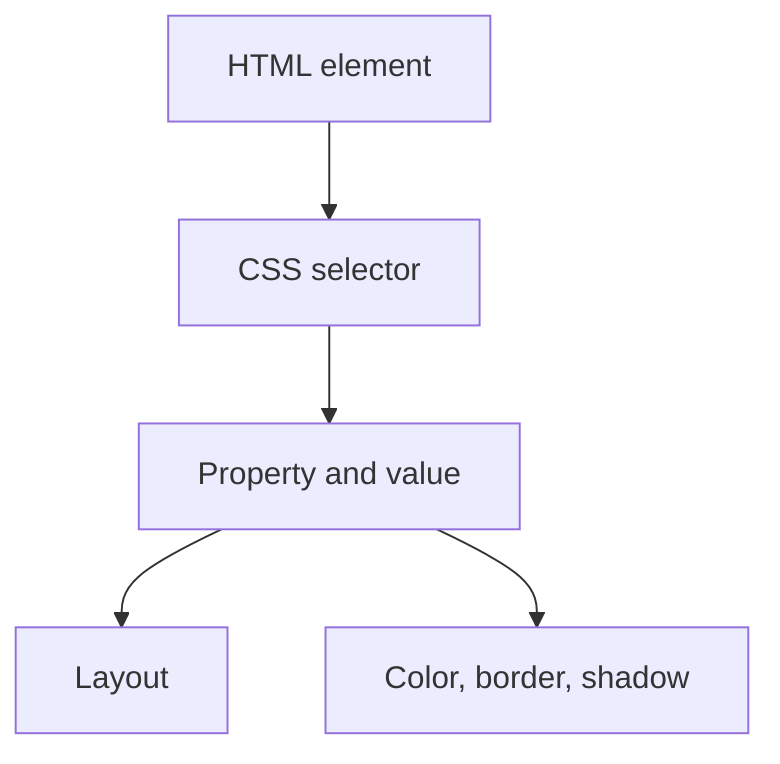

so to make the box in grid we use
display :grid

to make number of column we use
grid-tempate-column:200px,200px,200px
grid-tempate-row:200px,200px,200px

![[Pasted image 20260802022517.png]]

1fr is resizeto size

![[Pasted image 20260802022545.png]]

vh and fr

## imp concepts

git-auto-rows so it manage if there is any inconsistency in the grid number this is much better
grid-auto-flow so similar to left flow so left scroll
grid-template-area

![[Pasted image 20260802024618.png|409]]

## justify and align

justify-item :center
align-item :center
so this will make the item in center

so justify item is mainthat focus on horizontal thing
and the align item focus on horizontal things

justify-content
align content
so these re based on he text  so it change the structure of the text

## Revision notes

### What it is

CSS Grid is a two-dimensional layout system for rows and columns.

### Why it matters

- It helps you understand the main job of `grid`.
- It gives a mental model for interviews, revision, and building real projects.
- It connects with nearby notes in this vault, so revise it with the content table and related links.

### How to think about it

Ask these questions:

- What problem does it solve?
- What are the main parts?
- What happens step by step?
- Where is it used in real projects?
- What mistake should I avoid?

### Diagram

### Key terms

`grid container`, `tracks`, `row`, `column`, `gap`, `area`

### Real project example

In a real app, `grid` is not learned alone. It connects with frontend, backend, database, browser, network, and deployment decisions.

Example revision flow:

1. Define the topic in one sentence.
2. Draw the flow from memory.
3. Explain one real use case.
4. Say one advantage.
5. Say one limitation or mistake.

### Common mistakes

- Memorizing the word but not knowing the flow.
- Not knowing when to use it.
- Mixing similar topics without comparing them.
- Forgetting the tradeoff.

### Quick revision

- Main idea: CSS Grid is a two-dimensional layout system for rows and columns.
- Remember the keywords: grid container, tracks, row, column.
- Best way to revise: explain it out loud with a small example and the diagram.
