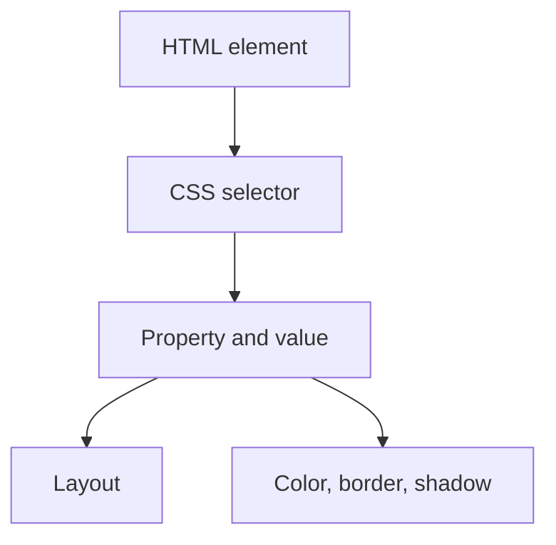

## inline

so this take a small space here in the text span tag is one of the example

## block

so these are tag that take a lot space int he text
so it take all the complete  space of the line

## Complete notes

HTML elements mainly behave like inline or block elements.

## Inline

Inline elements take only the space needed by their content.

Examples:

- `span`
- `a`
- `strong`
- `img`

Inline elements do not start on a new line by default.

## Block

Block elements take the full width available.

Examples:

- `div`
- `p`
- `section`
- `h1`

Block elements start on a new line.

## Inline-block

`inline-block` behaves inline from outside, but block-like from inside.

This means we can set width, height, margin, and padding.

## Revision notes

### What it is

Display type controls whether elements flow inline, as blocks, or mixed as inline-block.

### Why it matters

- It helps you understand the main job of `inline block`.
- It gives a mental model for interviews, revision, and building real projects.
- It connects with nearby notes in this vault, so revise it with the content table and related links.

### How to think about it

Ask these questions:

- What problem does it solve?
- What are the main parts?
- What happens step by step?
- Where is it used in real projects?
- What mistake should I avoid?

### Diagram

### Key terms

`inline`, `block`, `inline-block`, `width`, `height`

### Real project example

In a real app, `inline block` is not learned alone. It connects with frontend, backend, database, browser, network, and deployment decisions.

Example revision flow:

1. Define the topic in one sentence.
2. Draw the flow from memory.
3. Explain one real use case.
4. Say one advantage.
5. Say one limitation or mistake.

### Common mistakes

- Memorizing the word but not knowing the flow.
- Not knowing when to use it.
- Mixing similar topics without comparing them.
- Forgetting the tradeoff.

### Quick revision

- Main idea: Display type controls whether elements flow inline, as blocks, or mixed as inline-block.
- Remember the keywords: inline, block, inline-block, width.
- Best way to revise: explain it out loud with a small example and the diagram.
