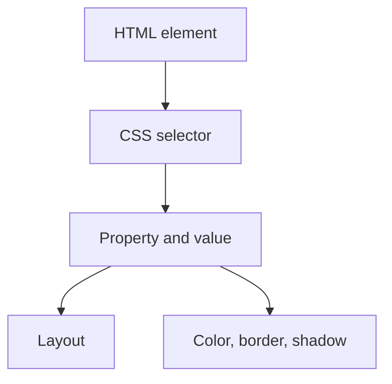

# shadows

![[Pasted image 20260802021610.png]]

## Complete notes

CSS shadows add depth to elements and text.

## Box shadow

`box-shadow` is used for cards, buttons, boxes, and images.

```css

.card {
  box-shadow: 0 4px 12px rgba(0, 0, 0, 0.15);
}

```

## Text shadow

`text-shadow` is used for text.

```css

h1 {
  text-shadow: 1px 1px 2px black;
}

```

## Shadow values

- First value is x-axis.
- Second value is y-axis.
- Third value is blur.
- Fourth optional value is spread.
- Color decides how strong the shadow looks.

## Revision notes

### What it is

CSS shadows create visual depth for boxes and text.

### Why it matters

- It helps you understand the main job of `shadows`.
- It gives a mental model for interviews, revision, and building real projects.
- It connects with nearby notes in this vault, so revise it with the content table and related links.

### How to think about it

Ask these questions:

- What problem does it solve?
- What are the main parts?
- What happens step by step?
- Where is it used in real projects?
- What mistake should I avoid?

### Diagram



### Key terms

`box-shadow`, `text-shadow`, `blur`, `spread`, `rgba`

### Real project example

In a real app, `shadows` is not learned alone. It connects with frontend, backend, database, browser, network, and deployment decisions.

Example revision flow:

1. Define the topic in one sentence.
2. Draw the flow from memory.
3. Explain one real use case.
4. Say one advantage.
5. Say one limitation or mistake.

### Common mistakes

- Memorizing the word but not knowing the flow.
- Not knowing when to use it.
- Mixing similar topics without comparing them.
- Forgetting the tradeoff.

### Quick revision

- Main idea: CSS shadows create visual depth for boxes and text.
- Remember the keywords: box-shadow, text-shadow, blur, spread.
- Best way to revise: explain it out loud with a small example and the diagram.
