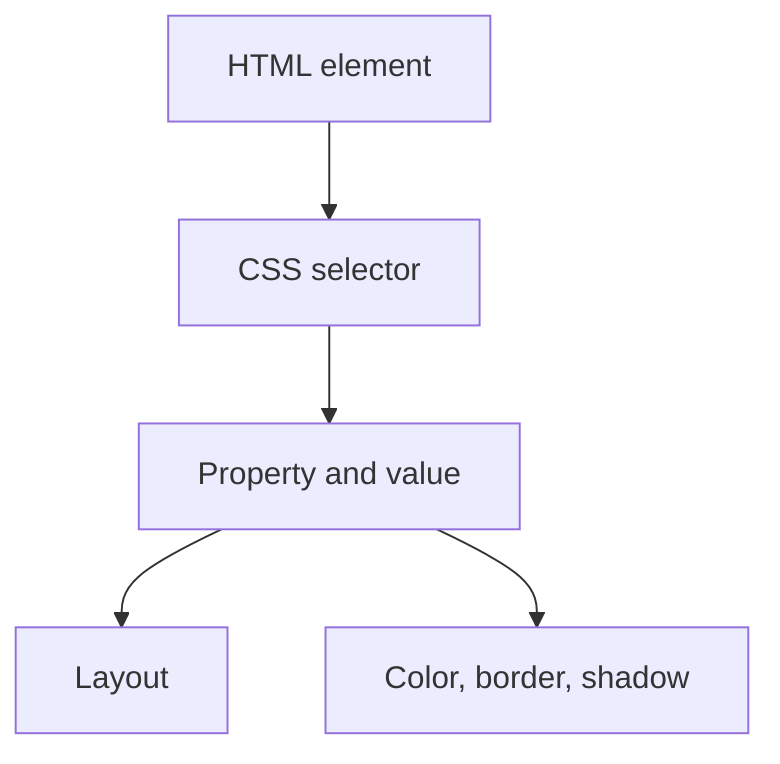

## Font family

`this the the font style of text`

font-family:san-serif

and for multiple thing
`font-family:san-serif,test; `

## font size

font-size
for font size

## font width

`font-width`

## font size

to change the font size

`font-size:23px`

## text decoration

to decorate the text
`text-decoration:cyan dotted line `

## body style

body-style:utset

## border radius

boder-radius

## padding

padding:5px

## background

background: linear-gradient(blue,green)
background-repeat:no repeat
background-attachment:fixed  to fix the background
background-image:url(path_of_it). image
background_position :center
background_ size:cover

## margin

boder:12px
so this  here the space above the green box is margin

![[Pasted image 20260802011510.png|213]]

marin left:50%

## Padding

do this the the  space between the margin and the text
so here the green box space is bigger
the space between the text and margin is padding

![[Pasted image 20260802011632.png|192]]

## image

float:left.  so here the text is stick u can check

![[Pasted image 20260802011958.png|321]]

## gap

gap:1px

## Revision notes

### What it is

CSS style properties control layout, color, spacing, borders, fonts, and backgrounds.

### Why it matters

- It helps you understand the main job of `styles`.
- It gives a mental model for interviews, revision, and building real projects.
- It connects with nearby notes in this vault, so revise it with the content table and related links.

### How to think about it

Ask these questions:

- What problem does it solve?
- What are the main parts?
- What happens step by step?
- Where is it used in real projects?
- What mistake should I avoid?

### Diagram

### Key terms

`box model`, `font`, `margin`, `padding`, `border`, `background`

### Real project example

In a real app, `styles` is not learned alone. It connects with frontend, backend, database, browser, network, and deployment decisions.

Example revision flow:

1. Define the topic in one sentence.
2. Draw the flow from memory.
3. Explain one real use case.
4. Say one advantage.
5. Say one limitation or mistake.

### Common mistakes

- Memorizing the word but not knowing the flow.
- Not knowing when to use it.
- Mixing similar topics without comparing them.
- Forgetting the tradeoff.

### Quick revision

- Main idea: CSS style properties control layout, color, spacing, borders, fonts, and backgrounds.
- Remember the keywords: box model, font, margin, padding.
- Best way to revise: explain it out loud with a small example and the diagram.
