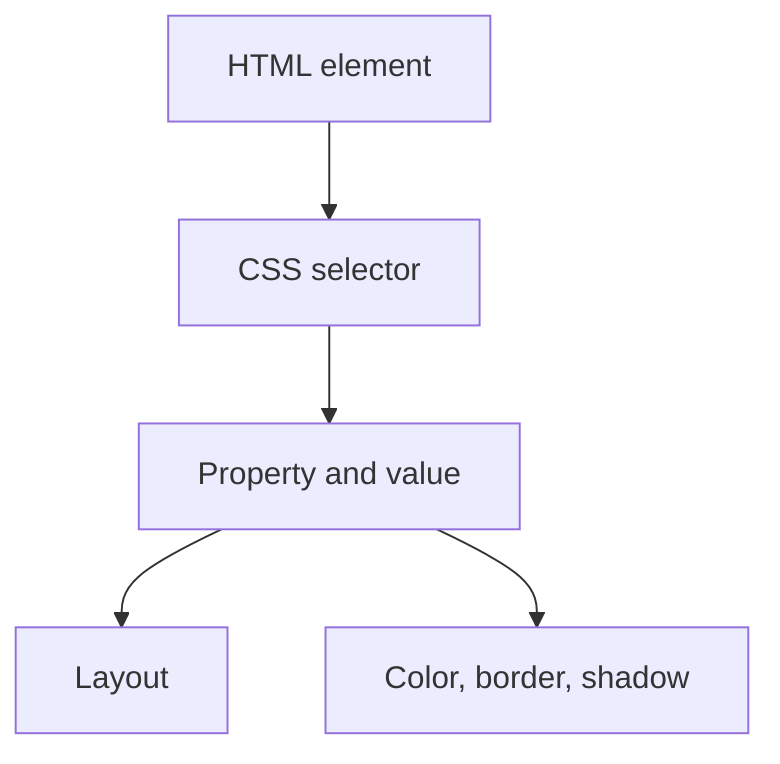

# sudo class

![[Pasted image 20260802015539.png|380]]

![[Pasted image 20260802015706.png|360]]

![[Pasted image 20260802015757.png|328]]

![[Pasted image 20260802015840.png|167]]

## Complete notes

Pseudo-class means a special state of an element.

It starts with one colon `:`.

## Common pseudo-classes

- `:hover` when mouse is over the element.
- `:focus` when input or button is selected.
- `:active` when element is being clicked.
- `:first-child` selects the first child.
- `:last-child` selects the last child.
- `:nth-child()` selects by position.

## Example

```css

button:hover {
  background: blue;
  color: white;
}

```

## Pseudo-class vs pseudo-element

- Pseudo-class selects a state.
- Pseudo-element selects a part, like `::before` or `::after`.

## Revision notes

### What it is

Pseudo-classes select elements in special states like hover, focus, and first child.

### Why it matters

- It helps you understand the main job of `Pseudo class`.
- It gives a mental model for interviews, revision, and building real projects.
- It connects with nearby notes in this vault, so revise it with the content table and related links.

### How to think about it

Ask these questions:

- What problem does it solve?
- What are the main parts?
- What happens step by step?
- Where is it used in real projects?
- What mistake should I avoid?

### Diagram



### Key terms

`:hover`, `:focus`, `:active`, `:nth-child`, `state`

### Real project example

In a real app, `Pseudo class` is not learned alone. It connects with frontend, backend, database, browser, network, and deployment decisions.

Example revision flow:

1. Define the topic in one sentence.
2. Draw the flow from memory.
3. Explain one real use case.
4. Say one advantage.
5. Say one limitation or mistake.

### Common mistakes

- Memorizing the word but not knowing the flow.
- Not knowing when to use it.
- Mixing similar topics without comparing them.
- Forgetting the tradeoff.

### Quick revision

- Main idea: Pseudo-classes select elements in special states like hover, focus, and first child.
- Remember the keywords: :hover, :focus, :active, :nth-child.
- Best way to revise: explain it out loud with a small example and the diagram.
