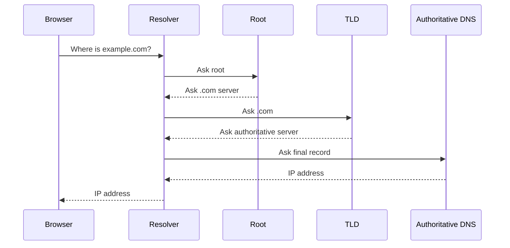

# whtat DNS

so it convert the human readble google .com to a ip addresss

## Complete notes

DNS means Domain Name System.

It converts a human name like `google.com` into an IP address like `142.250.x.x`.

## Why DNS is needed

Humans remember names easily.
Computers communicate using IP addresses.
DNS connects these two things.

## Common DNS records

- `A` record points a domain to an IPv4 address.
- `AAAA` record points a domain to an IPv6 address.
- `CNAME` points one name to another name.
- `MX` is used for email servers.
- `TXT` stores text data, often for verification and email security.

## Simple flow

1. User types a domain.
2. Browser asks DNS for the IP.
3. DNS resolver finds the correct record.
4. Browser connects to that IP.

## Revision notes

### What it is

DNS converts domain names into IP addresses.

### Why it matters

- It helps you understand the main job of `What DNS`.
- It gives a mental model for interviews, revision, and building real projects.
- It connects with nearby notes in this vault, so revise it with the content table and related links.

### How to think about it

Ask these questions:

- What problem does it solve?
- What are the main parts?
- What happens step by step?
- Where is it used in real projects?
- What mistake should I avoid?

### Diagram

### Key terms

`domain`, `IP address`, `resolver`, `record`, `TTL`

### Real project example

In a real app, `What DNS` is not learned alone. It connects with frontend, backend, database, browser, network, and deployment decisions.

Example revision flow:

1. Define the topic in one sentence.
2. Draw the flow from memory.
3. Explain one real use case.
4. Say one advantage.
5. Say one limitation or mistake.

### Common mistakes

- Memorizing the word but not knowing the flow.
- Not knowing when to use it.
- Mixing similar topics without comparing them.
- Forgetting the tradeoff.

### Quick revision

- Main idea: DNS converts domain names into IP addresses.
- Remember the keywords: domain, IP address, resolver, record.
- Best way to revise: explain it out loud with a small example and the diagram.
