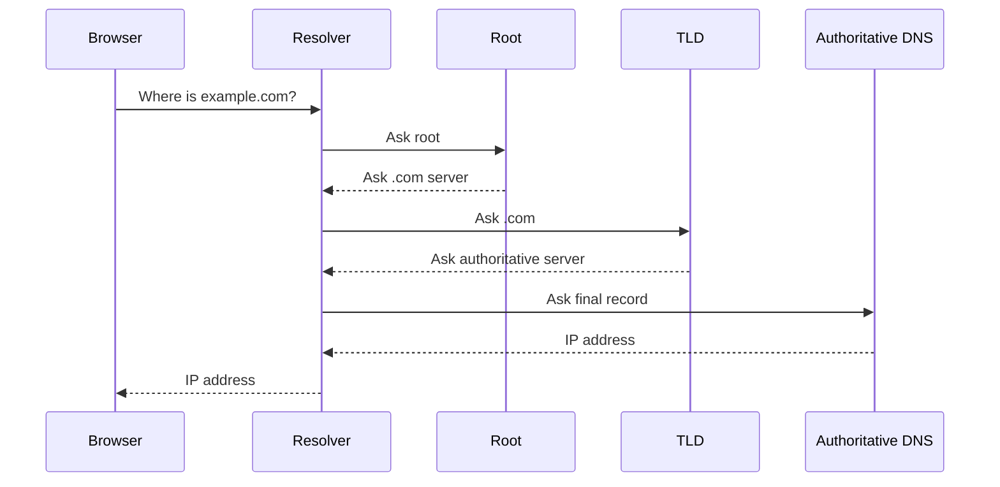

different level of DNS server

- root level
- Top level Domain(TLD)
- Authoritative Level

## Root Level

![[Pasted image 20260827014738.png]]

## TLD

![[Pasted image 20260827014817.png]]

## Complete flow

![[Pasted image 20260827015028.png]]

## Revision notes

### What it is

DNS lookup is the step-by-step process of finding the IP for a domain.

### Why it matters

- It helps you understand the main job of `work DNS`.
- It gives a mental model for interviews, revision, and building real projects.
- It connects with nearby notes in this vault, so revise it with the content table and related links.

### How to think about it

Ask these questions:

- What problem does it solve?
- What are the main parts?
- What happens step by step?
- Where is it used in real projects?
- What mistake should I avoid?

### Diagram

### Key terms

`recursive resolver`, `root server`, `TLD`, `authoritative server`, `cache`

### Real project example

In a real app, `work DNS` is not learned alone. It connects with frontend, backend, database, browser, network, and deployment decisions.

Example revision flow:

1. Define the topic in one sentence.
2. Draw the flow from memory.
3. Explain one real use case.
4. Say one advantage.
5. Say one limitation or mistake.

### Common mistakes

- Memorizing the word but not knowing the flow.
- Not knowing when to use it.
- Mixing similar topics without comparing them.
- Forgetting the tradeoff.

### Quick revision

- Main idea: DNS lookup is the step-by-step process of finding the IP for a domain.
- Remember the keywords: recursive resolver, root server, TLD, authoritative server.
- Best way to revise: explain it out loud with a small example and the diagram.
