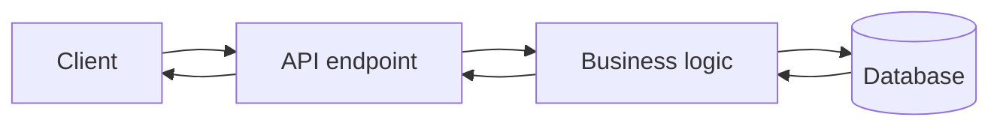

![[Pasted image 20260827021107.png]]

## 1NS

![[Pasted image 20260827021145.png]]

## 1-10ns

![[Pasted image 20260827021221.png]]

![[Pasted image 20260827021255.png]]

![[Pasted image 20260827021334.png]]

![[Pasted image 20260827021411.png]]

![[Pasted image 20260827021448.png]]

![[Pasted image 20260827021536.png]]

![[Pasted image 20260827021600.png]]

![[Pasted image 20260827021652.png]]

## Revision notes

### What it is

Latency is the delay between making a request and getting the response.

### Why it matters

- It helps you understand the main job of `what is latency`.
- It gives a mental model for interviews, revision, and building real projects.
- It connects with nearby notes in this vault, so revise it with the content table and related links.

### How to think about it

Ask these questions:

- What problem does it solve?
- What are the main parts?
- What happens step by step?
- Where is it used in real projects?
- What mistake should I avoid?

### Diagram

### Key terms

`network delay`, `processing time`, `round trip`, `p95`, `p99`

### Real project example

In a real app, `what is latency` is not learned alone. It connects with frontend, backend, database, browser, network, and deployment decisions.

Example revision flow:

1. Define the topic in one sentence.
2. Draw the flow from memory.
3. Explain one real use case.
4. Say one advantage.
5. Say one limitation or mistake.

### Common mistakes

- Memorizing the word but not knowing the flow.
- Not knowing when to use it.
- Mixing similar topics without comparing them.
- Forgetting the tradeoff.

### Quick revision

- Main idea: Latency is the delay between making a request and getting the response.
- Remember the keywords: network delay, processing time, round trip, p95.
- Best way to revise: explain it out loud with a small example and the diagram.
