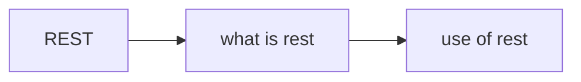

# REST content table

- what is rest [[what is rest]]
- use of rest[[use of rest]]

## Complete notes

REST topic map:

- [[what is rest]] explains REST idea.
- [[use of rest]] explains where REST is used.

## Must know

- REST works with resources.
- URL identifies the resource.
- HTTP method tells the action.
- JSON is commonly used for request and response body.

## Revision dashboard

### Main idea

REST designs APIs around resources, URLs, HTTP methods, and JSON responses.

### Study order

- [[what is rest]]
- [[use of rest]]

### Diagram

### How to revise this folder

1. Open this content table first.
2. Click each linked topic one by one.
3. Read the `Complete notes` and `Revision notes` sections.
4. Redraw the diagram from memory.
5. Explain one real example without looking.

### Revision checklist

- I can define REST in one sentence.
- I can explain each linked note.
- I can draw the topic flow.
- I know one use case.
- I know one common mistake.
