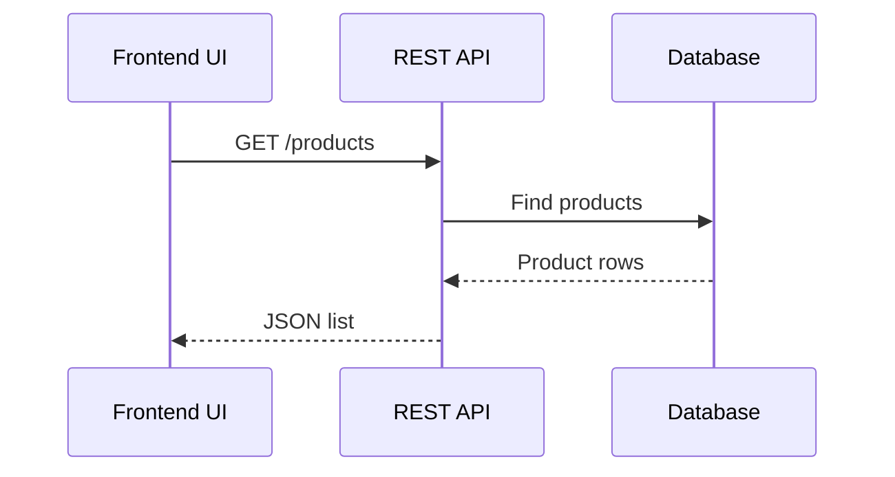

## pagination

![[Pasted image 20260902151019.png]]

version change

![[Pasted image 20260902151106.png]]

![[Pasted image 20260902151118.png]]

## Complete notes

REST is used to connect frontend, backend, mobile apps, and third-party systems.

## Common uses

- Login and signup.
- Fetch user profile.
- Create posts.
- Update orders.
- Delete records.
- Connect frontend React app to backend.

## Example

```text

GET /products
POST /products
GET /products/5
PATCH /products/5
DELETE /products/5

```

## Why REST is popular

- Simple to understand.
- Works with HTTP.
- Easy to test in browser/Postman.
- JSON is easy for frontend and backend.

## Revision notes

### What it is used for

REST is used when different parts of an app need to communicate through HTTP.

### Common places

- React frontend calling backend APIs.
- Mobile app fetching data from server.
- Admin dashboard managing data.
- Third-party integrations.
- Public APIs for developers.

### Diagram



### Good use cases

- CRUD apps.
- Blog apps.
- Ecommerce products and orders.
- User profile APIs.
- Simple backend/frontend communication.

### When another API style may be better

- Use WebSocket for real-time chat or live updates.
- Use GraphQL when frontend needs flexible nested data.
- Use gRPC for fast internal service-to-service calls.

### Quick revision

REST is best when the app works with clear resources and normal request-response flow.
