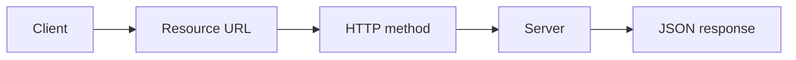

## Rest stand

Representational stae transfer

![[Pasted image 20260902144953.png]]

![[Pasted image 20260902150323.png]]

## Complete notes

[[REST API|REST]] means Representational State Transfer.

It is an API style based on resources.

## Resource

A resource is a thing like user, product, order, or post.

Example:

```text

/users
/users/10
/products

```

## HTTP methods

- `GET` reads data.
- `POST` creates data.
- `PUT` replaces data.
- `PATCH` updates part of data.
- `DELETE` removes data.

## REST idea

Use URLs for resources and HTTP methods for actions.

## Revision notes

### What it is

REST means Representational State Transfer. It is a common way to design APIs around resources.

### Core idea

- Resource means the thing you are working with, like user, product, post, or order.
- URL points to the resource.
- HTTP method tells the action.
- Response commonly comes back as JSON.

### Diagram



### Example

```text

GET /users
POST /users
GET /users/10
PATCH /users/10
DELETE /users/10
```

### Common mistakes

- Putting verbs in URLs like `/getUsers`.
- Using only `POST` for every action.
- Not using status codes properly.
- Returning different response shapes every time.

### Quick revision

REST = resource URL + HTTP method + stateless request + clear response.
