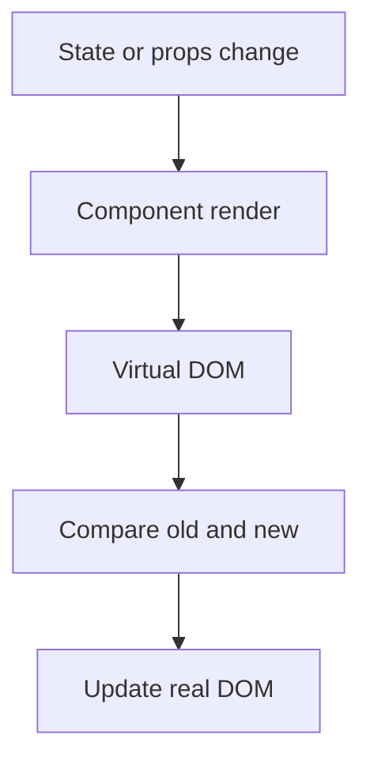

## **What is CDN**

![[Pasted image 20260803004339.png]]

## what we can do wit this

![[Pasted image 20260803004415.png]]

![[Pasted image 20260803004438.png]]

![[Pasted image 20260803004438.png]]

## Complete notes

CDN means Content Delivery Network.

In React learning, CDN can load React directly from internet script links without installing build tools.

## Example idea

```html

<script src="https://unpkg.com/react/umd/react.development.js"></script>
<script src="https://unpkg.com/react-dom/umd/react-dom.development.js"></script>

```

## Good for

- Quick demos.
- Learning React basics.
- Small experiments.

## Not best for

- Production React apps.
- Large projects.
- Apps needing bundling, routing, and build optimization.

## Revision notes

### What it is

A CDN can load React scripts directly for quick learning demos.

### Why it matters

- It helps you understand the main job of `CDN`.
- It gives a mental model for interviews, revision, and building real projects.
- It connects with nearby notes in this vault, so revise it with the content table and related links.

### How to think about it

Ask these questions:

- What problem does it solve?
- What are the main parts?
- What happens step by step?
- Where is it used in real projects?
- What mistake should I avoid?

### Diagram



### Key terms

`script tag`, `ReactDOM`, `unpkg`, `demo`, `production build`

### Real project example

In a real app, `CDN` is not learned alone. It connects with frontend, backend, database, browser, network, and deployment decisions.

Example revision flow:

1. Define the topic in one sentence.
2. Draw the flow from memory.
3. Explain one real use case.
4. Say one advantage.
5. Say one limitation or mistake.

### Common mistakes

- Memorizing the word but not knowing the flow.
- Not knowing when to use it.
- Mixing similar topics without comparing them.
- Forgetting the tradeoff.

### Quick revision

- Main idea: A CDN can load React scripts directly for quick learning demos.
- Remember the keywords: script tag, ReactDOM, unpkg, demo.
- Best way to revise: explain it out loud with a small example and the diagram.
