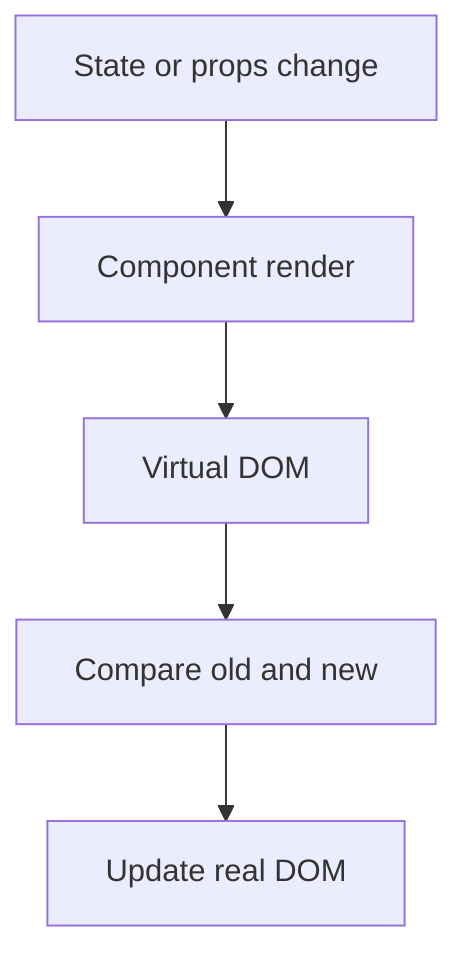

![[Pasted image 20260803024110.png]]

a example of rendring here

![[Pasted image 20260803024203.png]]

A: `Constructor` - The constructor method is the first to be called when a component is created. It's where we typically initialize the component's state and bind event handlers.

`Render` - The render method is responsible for rendering the component's UI. It must return a React element (typically JSX) representing the component's structure.

`ComponentDidMount` - This method is called immediately after the component is inserted into the DOM. It's often used for making AJAX requests, setting up subscriptions, or other one-time initializations.

`ComponentDidUpdate` - This method is called after the component has been updated (re-rendered) due to changes in state or props. It's often used for side effects, like updating the DOM in response to state or prop changes.

`ComponentWillUnmount` - This method is called just before the component is removed from the DOM. It's used to clean up resources or perform any necessary cleanup.

he `componentDidMount` lifecycle method in React class-based components is used for a specific purpose: it is called immediately after a component is inserted into the DOM (Document Object Model). This makes it a crucial point in the component's lifecycle and provides a valuable opportunity to perform various tasks that require interaction with the DOM or external data sources. Here are some common use cases for componentDidMount:

Fetching Data
DOM Manipulation

### `componentWillUnmount`

`componentWillUnmount` lifecycle method in React class-based components is used to perform cleanup and teardown tasks just before a component is removed from the DOM. It's a crucial part of managing resources and subscriptions to prevent memory leaks and ensure that the component's behavior is properly cleaned up.

`Cleanup Resources`
Cancel Pending Requests

## Revision notes

### What it is

React lifecycle describes what happens when a component mounts, updates, and unmounts.

### Why it matters

- It helps you understand the main job of `Lifecycle of React`.
- It gives a mental model for interviews, revision, and building real projects.
- It connects with nearby notes in this vault, so revise it with the content table and related links.

### How to think about it

Ask these questions:

- What problem does it solve?
- What are the main parts?
- What happens step by step?
- Where is it used in real projects?
- What mistake should I avoid?

### Diagram

### Key terms

`mount`, `update`, `unmount`, `effect cleanup`

### Real project example

In a real app, `Lifecycle of React` is not learned alone. It connects with frontend, backend, database, browser, network, and deployment decisions.

Example revision flow:

1. Define the topic in one sentence.
2. Draw the flow from memory.
3. Explain one real use case.
4. Say one advantage.
5. Say one limitation or mistake.

### Common mistakes

- Memorizing the word but not knowing the flow.
- Not knowing when to use it.
- Mixing similar topics without comparing them.
- Forgetting the tradeoff.

### Quick revision

- Main idea: React lifecycle describes what happens when a component mounts, updates, and unmounts.
- Remember the keywords: mount, update, unmount, effect cleanup.
- Best way to revise: explain it out loud with a small example and the diagram.
