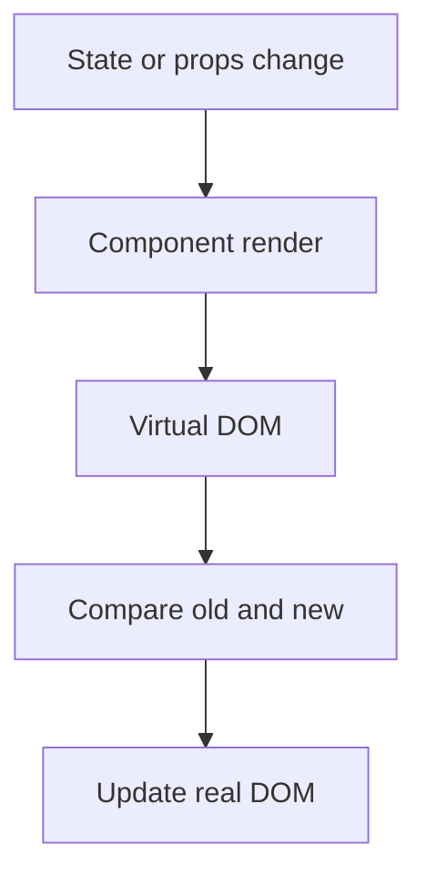

## What is `prop drilling`?

`rop drilling` refers to the process of `passing down props (short for properties) through multiple layers of nested components`. This happens when a piece of data needs to be transferred from a higher-level component to a deeply nested child component, and it must pass through several intermediary components in between.

// Top-level component
function App() {
const data = "Hello, prop drilling!";

return (

<ParentComponent data={data} />

);
}

// Intermediate component
function ParentComponent({ data }) {
return (

<ChildComponent data={data} />

);
}

// Deeply nested component that actually uses the data
function ChildComponent({ data }) {
return 
{data}
;
}

## Q: What is `lifting the state up`?

A: `Lifting state up` in React refers to the practice of `moving the state from a lower-level (child) component to a higher-level (parent or common ancestor) component in the component tree`. This is done to share and manage state across multiple components.

// Parent component
class ParentComponent extends React.Component {
constructor(props) {
super(props);
this.state = {
count: 0,
};
}

incrementCount = () => {
this.setState((prevState) => ({
count: prevState.count + 1,
}));
};

render() {
return (

Count: {this.state.count}

<ChildComponent count={this.state.count} onIncrement={this.incrementCount} />

);
}
}

// Child component
function ChildComponent({ count, onIncrement }) {
return (

Child Count: {count}

<button onClick={onIncrement}>Increment</button>

);
}

##  What are `Context Provider` and `Context Consumer`?

In React, the `Context API` provides a `way to pass data through the component tree without having to pass props manually at every level`. The two main components associated with the `Context API are the Context Provider and Context Consumer`.

`Context Provider`: The Context Provider is a `component that allows its children to subscribe to a context's changes`. It accepts a value prop, which is the data that will be shared with the components that are descendants of this provider. The Provider component is created using `React.createContext()`

// Creating a context
const MyContext = React.createContext();

// Parent component serving as the provider
class MyProvider extends React.Component {
state = {
data: "Hello from Context!",
};

render() {
return (
<MyContext.Provider value={this.state.data}>
{this.props.children}
</MyContext.Provider>
);
}
}

`Context Consumer`: The Context Consumer is a component that subscribes to the changes in the context provided by its nearest Context Provider ancestor. It allows components to access the context data without the need for prop drilling.

// Child component consuming the context
class MyConsumerComponent extends React.Component {
render() {
return (
<MyContext.Consumer>
{(contextData) => (

{contextData}

)}
</MyContext.Consumer>
);
}
}

## If we don't pass a value to the provider does it take the default value?

`it does use the default value specified when creating the context using React.createContext(defaultValue)`.

## Revision notes

### What it is

Prop drilling happens when props are passed through many layers only to reach a deep child.

### Why it matters

- It helps you understand the main job of `Prop drilling`.
- It gives a mental model for interviews, revision, and building real projects.
- It connects with nearby notes in this vault, so revise it with the content table and related links.

### How to think about it

Ask these questions:

- What problem does it solve?
- What are the main parts?
- What happens step by step?
- Where is it used in real projects?
- What mistake should I avoid?

### Diagram

### Key terms

`props`, `parent`, `child`, `context`, `global state`

### Real project example

In a real app, `Prop drilling` is not learned alone. It connects with frontend, backend, database, browser, network, and deployment decisions.

Example revision flow:

1. Define the topic in one sentence.
2. Draw the flow from memory.
3. Explain one real use case.
4. Say one advantage.
5. Say one limitation or mistake.

### Common mistakes

- Memorizing the word but not knowing the flow.
- Not knowing when to use it.
- Mixing similar topics without comparing them.
- Forgetting the tradeoff.

### Quick revision

- Main idea: Prop drilling happens when props are passed through many layers only to reach a deep child.
- Remember the keywords: props, parent, child, context.
- Best way to revise: explain it out loud with a small example and the diagram.
