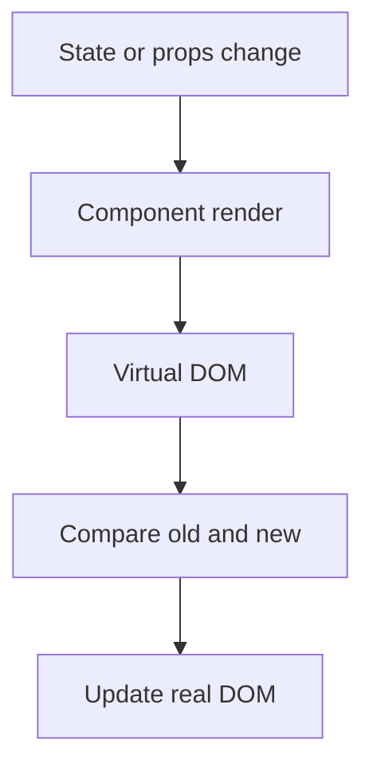
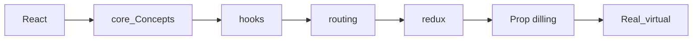

# React Content

- CDN[[CDN]]
- LIB VS Framework[[lib_frame]]
- DOM[[Real_virtual]]
- async_deffer[[asyncVSdeffer]]
- core Concepts[[core_Concepts]]
- HOOKS[[hooks]]
- Async_await[[async_await]]
- Routing in react[[routing]]
- LIFE cycle of react[[LIFE_Of _REact]]
- microservise  vs monolithic[[mcroservise_monolith]]
- Prop drilling[[Prop dilling]]
- Redux[[redux]]

shortcut to write  react component "rafce"

## Complete notes

React topic map:

- [[core_Concepts]] explains components, JSX, props, state, and rendering.
- [[hooks]] explains React hooks.
- [[routing]] explains page navigation.
- [[redux]] explains global state management.
- [[Prop dilling]] explains prop passing problem.
- [[Real_virtual]] explains real DOM and virtual DOM.
- [[LIFE_Of _REact]] explains component lifecycle.
- [[CDN]] explains loading React from CDN.
- [[asyncVSdeffer]] explains script loading.

## Must know

React builds UI using components.
When state changes, React updates the UI.

## Revision notes

### What it is

React builds user interfaces from reusable components.

### Why it matters

- It helps you understand the main job of `React Content`.
- It gives a mental model for interviews, revision, and building real projects.
- It connects with nearby notes in this vault, so revise it with the content table and related links.

### How to think about it

Ask these questions:

- What problem does it solve?
- What are the main parts?
- What happens step by step?
- Where is it used in real projects?
- What mistake should I avoid?

### Diagram

### Key terms

`component`, `JSX`, `props`, `state`, `render`

### Real project example

In a real app, `React Content` is not learned alone. It connects with frontend, backend, database, browser, network, and deployment decisions.

Example revision flow:

1. Define the topic in one sentence.
2. Draw the flow from memory.
3. Explain one real use case.
4. Say one advantage.
5. Say one limitation or mistake.

### Common mistakes

- Memorizing the word but not knowing the flow.
- Not knowing when to use it.
- Mixing similar topics without comparing them.
- Forgetting the tradeoff.

### Quick revision

- Main idea: React builds user interfaces from reusable components.
- Remember the keywords: component, JSX, props, state.
- Best way to revise: explain it out loud with a small example and the diagram.

## Revision dashboard

### Main idea

React builds UI from components and updates the screen when state changes.

### Study order

- [[core_Concepts]]
- [[hooks]]
- [[routing]]
- [[redux]]
- [[Prop dilling]]
- [[Real_virtual]]
- [[LIFE_Of _REact]]
- [[CDN]]
- [[asyncVSdeffer]]
- [[async_await]]
- [[lib_frame]]

### Diagram

### How to revise this folder

1. Open this content table first.
2. Click each linked topic one by one.
3. Read the `Complete notes` and `Revision notes` sections.
4. Redraw the diagram from memory.
5. Explain one real example without looking.

### Revision checklist

- I can define React in one sentence.
- I can explain each linked note.
- I can draw the topic flow.
- I know one use case.
- I know one common mistake.
