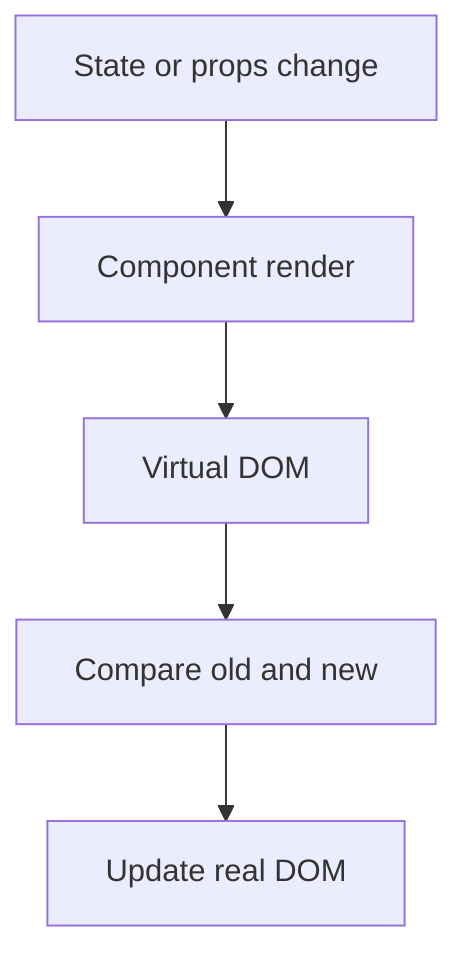

in reach there are 2 types of DOM

- Real
- virtual

## Real Dom

![[Pasted image 20260803010406.png]]

## Virtual

![[Pasted image 20260803010425.png]]

## Reconciliation

so check the page

## Complete notes

Real DOM is the browser's actual page tree.

Virtual DOM is React's lightweight representation of UI in memory.

## Why virtual DOM helps

React can compare old UI and new UI.
Then it updates only the needed parts in the real DOM.

## Important point

Virtual DOM is not magic speed for everything.
Its main benefit is making UI updates predictable and easier to manage.

## Simple flow

1. State changes.
2. React creates new virtual DOM.
3. React compares with old virtual DOM.
4. React updates real DOM where needed.

## Revision notes

### What it is

React uses a virtual DOM idea to calculate UI changes before updating the real DOM.

### Why it matters

- It helps you understand the main job of `Real virtual`.
- It gives a mental model for interviews, revision, and building real projects.
- It connects with nearby notes in this vault, so revise it with the content table and related links.

### How to think about it

Ask these questions:

- What problem does it solve?
- What are the main parts?
- What happens step by step?
- Where is it used in real projects?
- What mistake should I avoid?

### Diagram

### Key terms

`render`, `diff`, `reconciliation`, `DOM update`

### Real project example

In a real app, `Real virtual` is not learned alone. It connects with frontend, backend, database, browser, network, and deployment decisions.

Example revision flow:

1. Define the topic in one sentence.
2. Draw the flow from memory.
3. Explain one real use case.
4. Say one advantage.
5. Say one limitation or mistake.

### Common mistakes

- Memorizing the word but not knowing the flow.
- Not knowing when to use it.
- Mixing similar topics without comparing them.
- Forgetting the tradeoff.

### Quick revision

- Main idea: React uses a virtual DOM idea to calculate UI changes before updating the real DOM.
- Remember the keywords: render, diff, reconciliation, DOM update.
- Best way to revise: explain it out loud with a small example and the diagram.
