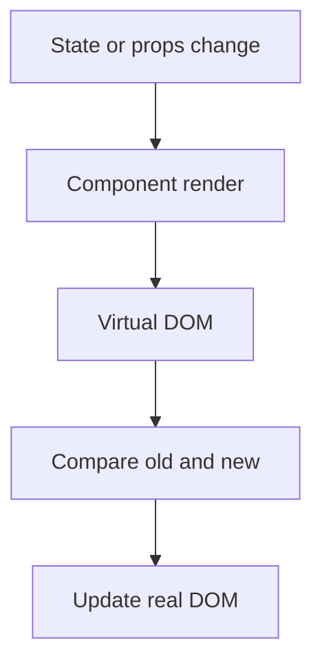

# asyncVSdeffer

![[Pasted image 20260803013330.png]]

## Complete notes

`async` and `defer` are used with script tags.

They control how JavaScript loads with HTML.

## Normal script

HTML parsing stops while script downloads and runs.

## async

- Script downloads in parallel.
- Script runs as soon as download finishes.
- Order is not guaranteed.
- Good for independent scripts like analytics.

## defer

- Script downloads in parallel.
- Script runs after HTML parsing is complete.
- Order is preserved.
- Good for normal app scripts.

## Simple rule

Use `defer` for most scripts.
Use `async` when script does not depend on other scripts or DOM order.

## Revision notes

### What it is

async and defer control how script tags load and run with HTML parsing.

### Why it matters

- It helps you understand the main job of `asyncVSdeffer`.
- It gives a mental model for interviews, revision, and building real projects.
- It connects with nearby notes in this vault, so revise it with the content table and related links.

### How to think about it

Ask these questions:

- What problem does it solve?
- What are the main parts?
- What happens step by step?
- Where is it used in real projects?
- What mistake should I avoid?

### Diagram

### Key terms

`download`, `execute`, `HTML parsing`, `order`

### Real project example

In a real app, `asyncVSdeffer` is not learned alone. It connects with frontend, backend, database, browser, network, and deployment decisions.

Example revision flow:

1. Define the topic in one sentence.
2. Draw the flow from memory.
3. Explain one real use case.
4. Say one advantage.
5. Say one limitation or mistake.

### Common mistakes

- Memorizing the word but not knowing the flow.
- Not knowing when to use it.
- Mixing similar topics without comparing them.
- Forgetting the tradeoff.

### Quick revision

- Main idea: async and defer control how script tags load and run with HTML parsing.
- Remember the keywords: download, execute, HTML parsing, order.
- Best way to revise: explain it out loud with a small example and the diagram.
