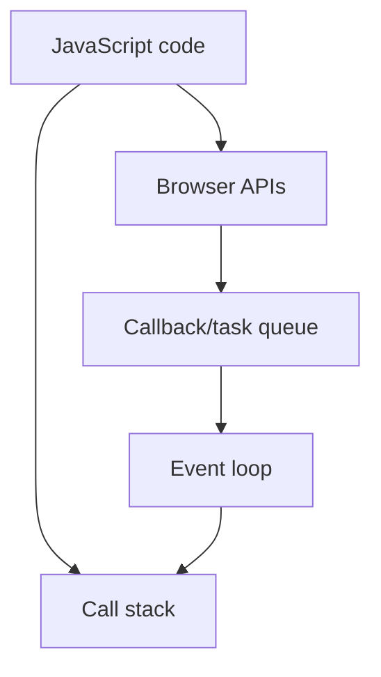

## async function

![[Pasted image 20260803023325.png]]

## Await keyword

- *await is used inside async function only**

![[Pasted image 20260803023413.png]]

## Complete notes

`async` and `await` make promise code easier to read.

## async

An `async` function always returns a Promise.

## await

`await` pauses inside the async function until the Promise settles.

## Example

```js

async function getUser() {
  const res = await fetch("/api/user");
  const data = await res.json();
  return data;
}

```

## Error handling

Use `try/catch`.

```js

try {
  const data = await getUser();
} catch (error) {
  console.log(error);
}

```

## Revision notes

### What it is

async/await makes Promise code look like step-by-step code.

### Why it matters

- It helps you understand the main job of `async await`.
- It gives a mental model for interviews, revision, and building real projects.
- It connects with nearby notes in this vault, so revise it with the content table and related links.

### How to think about it

Ask these questions:

- What problem does it solve?
- What are the main parts?
- What happens step by step?
- Where is it used in real projects?
- What mistake should I avoid?

### Diagram



### Key terms

`async function`, `await`, `try/catch`, `fetch`

### Real project example

In a real app, `async await` is not learned alone. It connects with frontend, backend, database, browser, network, and deployment decisions.

Example revision flow:

1. Define the topic in one sentence.
2. Draw the flow from memory.
3. Explain one real use case.
4. Say one advantage.
5. Say one limitation or mistake.

### Common mistakes

- Memorizing the word but not knowing the flow.
- Not knowing when to use it.
- Mixing similar topics without comparing them.
- Forgetting the tradeoff.

### Quick revision

- Main idea: async/await makes Promise code look like step-by-step code.
- Remember the keywords: async function, await, try/catch, fetch.
- Best way to revise: explain it out loud with a small example and the diagram.
