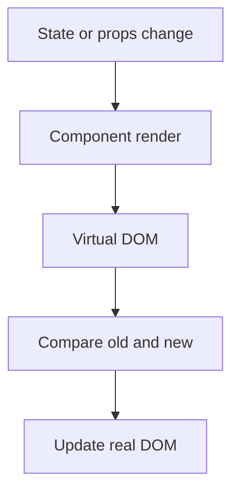

## What is package.json

![[Pasted image 20260803013711.png]]

## What is a bundler

![[Pasted image 20260803013806.png]]

## Page render and Api calling

![[Pasted image 20260803022549.png]]

## Shimmer UI

![[Pasted image 20260803022726.png]]

## Optional Chaining

![[Pasted image 20260803023142.png]]

const person = {
name: "John",
address: {
city: "New York",
},
};

const city = person.address?.city; // "New York"
const country = person.address?.country; // undefined

## JavaScript Expression

5 + 3       // Produces the value 8
"Hello"     // Produces the string value "Hello"
myVariable  // Produces the value stored in the variable myVariable
func(4)     // Calls a function and produces its return value

## JavaScript Statement

if (x > 10) {
// Conditional statement
// Executes a block of code if x is greater than 10
}

for (let i = 0; i < 5; i++) {
// Loop statement
// Repeats a block of code five times
}

function greet(name) {
// Function declaration statement
console.log("Hello, " + name);
}

let y = 42;  // Variable assignment statement

## Conditional rendering

import React, { useState } from 'react';

function App() {
const [isLoggedIn, setIsLoggedIn] = useState(false);

return (

<h1>Conditional Rendering Example</h1>
{isLoggedIn ? (
<WelcomeUser />
) : (
<Login />
)}

);
}

function WelcomeUser() {
return (

<h2>Welcome, User!</h2>
<button>Log Out</button>

);
}

function Login() {
return (

<h2>Please Log In</h2>
<form>
<input type="text" placeholder="Username" />
<input type="password" placeholder="Password" />
<button>Login</button>
</form>

);
}

export default App;

## `SPA`

A: SPA stands for `Single Page Application`. It's a type of web application or website that interacts with the user by dynamically rewriting the current web page rather than loading entire new pages from the server. In other words, a single HTML page is loaded initially, and then the content is updated dynamically as the user interacts with the application, typically through JavaScript.

Dynamic Updates
Smooth User Experience
Faster Initial Load
API-Centric

## What is the difference between `Client Side Routing` and `Server Side Routing`

`Client-Side Routing`: `Handling on the Client` - In client-side routing, routing and navigation are managed on the client side, typically within the web browse

Faster Transitions
Single-Page Application (SPA)
SEO Challenges

`Server-Side Routing`

`Handling on the Server` - Server-side routing manages routing and navigation on the server. When a user requests a different URL, the server generates and sends a new HTML page for that route.
Slower Transition
Traditional Websites
SEO-Friendly

## Why do we use `super(props)` in constructor?

Access to Parent Class's Constructor
`Passing Props to the Parent Constructor`

class MyComponent extends React.Component {
constructor(props) {
super(props); // Call the constructor of the parent class (React.Component)
// Initialize your component's state or perform other setup
}

render() {
// Render the component based on its state and props
return 
{this.props.someProp}
;
}
}

## Why can't we have the `callback function` of `useEffect async`?

In React, the `useEffect` hook is designed to handle side effects in functional components. It's a powerful and flexible tool for managing asynchronous operations, such as data fetching, API calls, and more. However, useEffect itself cannot directly accept an async callback function. This is because useEffect expects its callback function to return either nothing (i.e., undefined) or a cleanup function, and it doesn't work well with Promises returned from async functions.

##  `lazy()`

The `lazy()` function is a feature in React that allows us to `load components dynamically, or lazily, only when they are needed`. This can be beneficial for improving the performance and load times of our web application, especially if it contains a large number of components or if some components are rarely used. Here's when and why we might need to use lazy():

import React, { lazy, Suspense } from 'react';

const LazyComponent = lazy(() => import('./LazyComponent'));

function App() {
return (

<Suspense fallback={
Loading...
}>
<LazyComponent />
</Suspense>

);
}

export default App;

## `suspense`

In React, `Suspense` is a feature that allows us to declaratively manage asynchronous data fetching and code-splitting in our applications. It is primarily used in combination with the lazy() function for dynamic imports and with the React.lazy() component to improve the user experience when loading data or components asynchronously.

Data Fetching
Code Splitting
Error Handling
import React, { Suspense } from 'react';

const fetchData = () => {
return new Promise((resolve) => {
setTimeout(() => {
resolve("Data fetched!");
}, 2000);
});
};

function DataFetchingComponent() {
const data = fetchData();

return (

<Suspense fallback={
Loading data...
}>
<AsyncDataComponent data={data} />
</Suspense>

);
}

function AsyncDataComponent({ data }) {
return 
{data}
;
}

### `A component was suspended while responding to synchronous input. This will cause the UI to be replaced with a loading indicator. To fix this, updates that suspend should be wrapped with start transition`

? How does suspense fix this error?
To understand this error and how to fix it, you need to know a bit about how Suspense works and why it's important. Suspense is used to manage asynchronous data fetching and code-splitting, allowing you to display a loading indicator while the data or code is being fetched. When React encounters a Suspense boundary (created using ), it knows that there might be a delay in rendering, and it can handle that situation gracefully.

The error message you provided, "A component was suspended while responding to synchronous input. This will cause the UI to be replaced with a loading indicator. To fix this, updates that suspend should be wrapped with start transition," is related to React's Suspense feature and is typically encountered in asynchronous contexts where components are fetching data or handling code splitting.

import React, { Suspense, lazy } from 'react';

const AsyncComponent = lazy(() => import('./AsyncComponent'));

function App() {
// Synchronous code
return (

<h1>Your App</h1>
<Suspense fallback={
Loading...
}>
<AsyncComponent />
</Suspense>

);
}

export default App;

## Revision notes

### What it is

React core concepts are components, JSX, props, state, events, and rendering.

### Why it matters

- It helps you understand the main job of `core Concepts`.
- It gives a mental model for interviews, revision, and building real projects.
- It connects with nearby notes in this vault, so revise it with the content table and related links.

### How to think about it

Ask these questions:

- What problem does it solve?
- What are the main parts?
- What happens step by step?
- Where is it used in real projects?
- What mistake should I avoid?

### Diagram

### Key terms

`component`, `JSX`, `props`, `state`, `event`, `conditional rendering`

### Real project example

In a real app, `core Concepts` is not learned alone. It connects with frontend, backend, database, browser, network, and deployment decisions.

Example revision flow:

1. Define the topic in one sentence.
2. Draw the flow from memory.
3. Explain one real use case.
4. Say one advantage.
5. Say one limitation or mistake.

### Common mistakes

- Memorizing the word but not knowing the flow.
- Not knowing when to use it.
- Mixing similar topics without comparing them.
- Forgetting the tradeoff.

### Quick revision

- Main idea: React core concepts are components, JSX, props, state, events, and rendering.
- Remember the keywords: component, JSX, props, state.
- Best way to revise: explain it out loud with a small example and the diagram.
