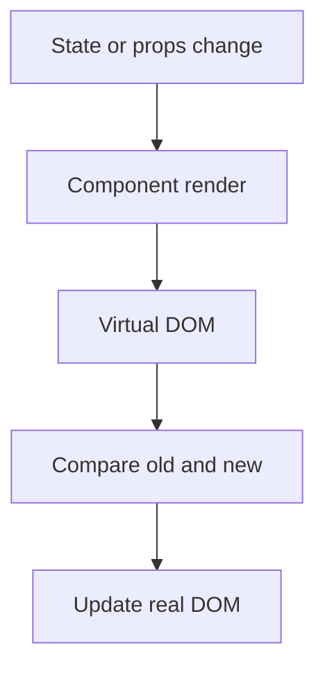

## Use State

![[Pasted image 20260803022414.png]]

## Use Effect

![[Pasted image 20260803022940.png]]

![[Pasted image 20260803023056.png]]

import React, { useEffect, useState } from 'react';

function DataFetching() {
const [data, setData] = useState([]);

useEffect(() => {
// Fetch data and update the state
fetch('[[Domain DNS HTTPS SSL TLS|https]]://api.example.com/data')
.then(response => response.json())
.then(data => setData(data));
}, []);

return (
<ul>
{data.map(item => (
<li key={item.id}>{item.name}</li>
))}
</ul>
);
}
syntax
useEffect(() => {}, []);

used for
Data Fetching
DOM Manipulation
Subscriptions
Avoiding Memory Leaks

## useContext

his hook allows us to access the context in our component tree. It's used to consume context values provided by a `Context.Provider`

import React, { useContext } from 'react';
import MyContext from './MyContext';

function MyComponent() {
const value = useContext(MyContext);

return 
Context Value: {value}
;
}

## useReducer

his hook is an alternative to useState for managing more complex state. It's often used when we need to manage state transitions in a predictable way, such as when building forms.

import React, { useReducer } from 'react';

const initialState = { count: 0 };

function reducer(state, action) {
switch (action.type) {
case 'increment':
return { count: state.count + 1 };
case 'decrement':
return { count: state.count - 1 };
default:
return state;
}
}

function Counter() {
const [state, dispatch] = useReducer(reducer, initialState);

return (

Count: {state.count}

<button onClick={() => dispatch({ type: 'increment' })}>Increment</button>
<button onClick={() => dispatch({ type: 'decrement' })}>Decrement</button>

);
}

## useRef

It is a React Hook that provides a way to create and access mutable references to a DOM element or a value that persists across renders in a functional component. It's particularly useful for accessing and interacting with DOM elements directly or for storing values that you don't want to trigger a re-render when they change.

import React, { useRef, useEffect } from 'react';

function MyComponent() {
const inputRef = useRef(null);

useEffect(() => {
inputRef.current.focus();
}, []);

return <input ref={inputRef} />;
}

## Revision notes

### What it is

Hooks let function components use React features like state, refs, context, and effects.

### Why it matters

- It helps you understand the main job of `hooks`.
- It gives a mental model for interviews, revision, and building real projects.
- It connects with nearby notes in this vault, so revise it with the content table and related links.

### How to think about it

Ask these questions:

- What problem does it solve?
- What are the main parts?
- What happens step by step?
- Where is it used in real projects?
- What mistake should I avoid?

### Diagram

### Key terms

`useState`, `useEffect`, `useRef`, `useContext`, `custom hook`

### Real project example

In a real app, `hooks` is not learned alone. It connects with frontend, backend, database, browser, network, and deployment decisions.

Example revision flow:

1. Define the topic in one sentence.
2. Draw the flow from memory.
3. Explain one real use case.
4. Say one advantage.
5. Say one limitation or mistake.

### Common mistakes

- Memorizing the word but not knowing the flow.
- Not knowing when to use it.
- Mixing similar topics without comparing them.
- Forgetting the tradeoff.

### Quick revision

- Main idea: Hooks let function components use React features like state, refs, context, and effects.
- Remember the keywords: useState, useEffect, useRef, useContext.
- Best way to revise: explain it out loud with a small example and the diagram.
