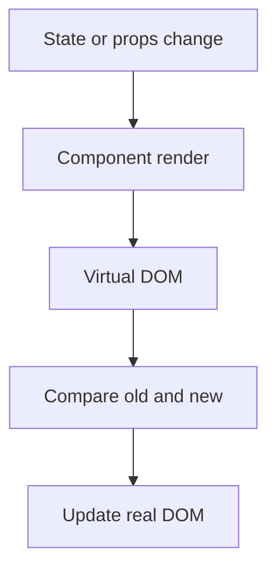

![[Pasted image 20260803005708.png]]

![[Pasted image 20260803005735.png]]

![[Pasted image 20260803005912.png]]

## Short disc

- *Library**: You are the architect. Your program calls the external code whenever it needs to perform an atomic operation, like parsing text, manipulating arrays, or rendering a chart.
- *Framework**: The framework acts as the blueprint. It provides a pre-built structural skeleton that mandates how you organize directories, define routing, and pass data. You fill in the empty spaces with your unique custom logic.

## Complete notes

Library and framework are related but different.

## Library

A library gives useful functions/components.
You call the library when you need it.

Example:

- React
- Lodash
- Axios

## Framework

A framework gives a bigger structure.
It often controls the flow of the app.

Example:

- Next.js
- Angular
- Django

## Simple difference

Library: you call it.
Framework: it calls your code inside its structure.

## Revision notes

### What it is

A library is called by your code, while a framework gives the structure your code fits into.

### Why it matters

- It helps you understand the main job of `lib frame`.
- It gives a mental model for interviews, revision, and building real projects.
- It connects with nearby notes in this vault, so revise it with the content table and related links.

### How to think about it

Ask these questions:

- What problem does it solve?
- What are the main parts?
- What happens step by step?
- Where is it used in real projects?
- What mistake should I avoid?

### Diagram

### Key terms

`library`, `framework`, `control flow`, `React`, `Next.js`

### Real project example

In a real app, `lib frame` is not learned alone. It connects with frontend, backend, database, browser, network, and deployment decisions.

Example revision flow:

1. Define the topic in one sentence.
2. Draw the flow from memory.
3. Explain one real use case.
4. Say one advantage.
5. Say one limitation or mistake.

### Common mistakes

- Memorizing the word but not knowing the flow.
- Not knowing when to use it.
- Mixing similar topics without comparing them.
- Forgetting the tradeoff.

### Quick revision

- Main idea: A library is called by your code, while a framework gives the structure your code fits into.
- Remember the keywords: library, framework, control flow, React.
- Best way to revise: explain it out loud with a small example and the diagram.
