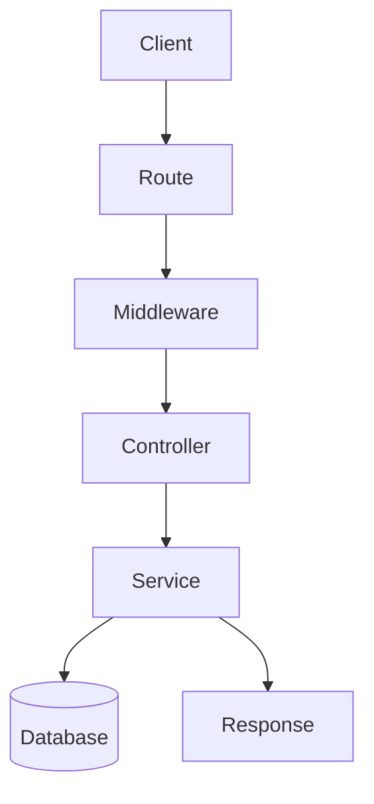

##  What is `Microservice`?

A `Microservice` is a software architectural style that structures an application as a collection of small, independent, and loosely coupled services

Decomposition
Independence
Loose Coupling
Scalability

## `Monolith architecture`

A `monolithic` architecture, also known as a monolithic application, is a traditional software architectural style in which an entire application is built as a single, self-contained unit. In a monolithic architecture
Single Codebase
Scaling Challenges
Single Deployment Uni

![[Pasted image 20260803230911.png]]

## Complete notes

Monolith and microservice are backend architecture styles.

## Monolith

One app contains most features together.

Good for:

- Small teams.
- Startup MVP.
- Simple deployment.

## Microservices

App is split into small independent services.

Good for:

- Large teams.
- Large systems.
- Independent scaling.

## Important point

Microservices add complexity.
Start with monolith unless there is a strong reason to split.

## Revision notes

### What it is

Monolith keeps app features together, while microservices split features into independent services.

### Why it matters

- It helps you understand the main job of `Microservice vs monolith`.
- It gives a mental model for interviews, revision, and building real projects.
- It connects with nearby notes in this vault, so revise it with the content table and related links.

### How to think about it

Ask these questions:

- What problem does it solve?
- What are the main parts?
- What happens step by step?
- Where is it used in real projects?
- What mistake should I avoid?

### Diagram

### Key terms

`deployment`, `service boundary`, `database`, `scaling`, `complexity`

### Real project example

In a real app, `Microservice vs monolith` is not learned alone. It connects with frontend, backend, database, browser, network, and deployment decisions.

Example revision flow:

1. Define the topic in one sentence.
2. Draw the flow from memory.
3. Explain one real use case.
4. Say one advantage.
5. Say one limitation or mistake.

### Common mistakes

- Memorizing the word but not knowing the flow.
- Not knowing when to use it.
- Mixing similar topics without comparing them.
- Forgetting the tradeoff.

### Quick revision

- Main idea: Monolith keeps app features together, while microservices split features into independent services.
- Remember the keywords: deployment, service boundary, database, scaling.
- Best way to revise: explain it out loud with a small example and the diagram.
