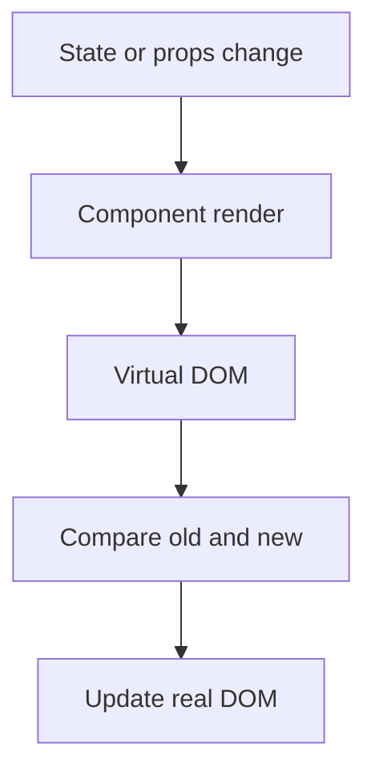

## `useContext` vs `Redux`

### useContext

is part of the React core and is used for managing state within the component tree. It provides a way to access the value of a context directly within a component and its descendants. It's typically used for smaller-scale state management needs within a component or a small section of the application.

## Redux:

edux is a state management library that provides a global state container for the entire application. It allows you to manage the application state in a predictable and centralized manner.

##  Advantages of using `Redux Toolkit over Redux`?

`Redux Toolkit` is a set of utility functions and abstractions that simplifies and streamlines the process of working with Redux

Less Boilerplate Code
Easier Async Operations

##  Explain `Dispatcher`?

n Redux, a `dispatcher` is not a standalone concept; instead, it's a term often used to refer to a function called dispatch. The dispatch function is a key part of the Redux store, and it plays a crucial role in the Redux data flow.

import { useDispatch } from 'react-redux';

const MyComponent = () => {
const dispatch = useDispatch();

const handleButtonClick = () => {
// Dispatching an action to increment the count
dispatch({ type: 'INCREMENT' });
};

return (
<button onClick={handleButtonClick}>
Increment Count
</button>
);
};

this example, the `useDispatch` hook from react-redux gives us access to the dispatch function, which we then use to send an action to the Redux store when the button is clicked. This action will be processed by the reducer, updating the state accordingly.

### Explain `Reducer`

## Revision notes

### What it is

Redux manages global app state in a predictable store.

### Why it matters

- It helps you understand the main job of `redux`.
- It gives a mental model for interviews, revision, and building real projects.
- It connects with nearby notes in this vault, so revise it with the content table and related links.

### How to think about it

Ask these questions:

- What problem does it solve?
- What are the main parts?
- What happens step by step?
- Where is it used in real projects?
- What mistake should I avoid?

### Diagram

### Key terms

`store`, `action`, `reducer`, `dispatch`, `selector`

### Real project example

In a real app, `redux` is not learned alone. It connects with frontend, backend, database, browser, network, and deployment decisions.

Example revision flow:

1. Define the topic in one sentence.
2. Draw the flow from memory.
3. Explain one real use case.
4. Say one advantage.
5. Say one limitation or mistake.

### Common mistakes

- Memorizing the word but not knowing the flow.
- Not knowing when to use it.
- Mixing similar topics without comparing them.
- Forgetting the tradeoff.

### Quick revision

- Main idea: Redux manages global app state in a predictable store.
- Remember the keywords: store, action, reducer, dispatch.
- Best way to revise: explain it out loud with a small example and the diagram.
