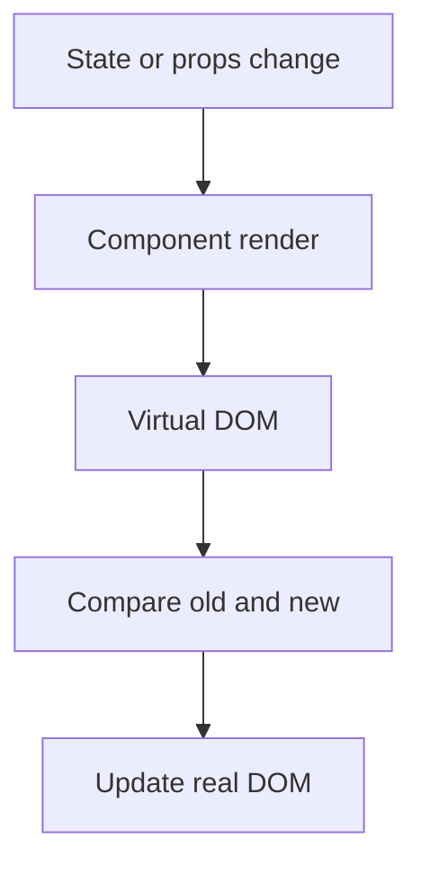

## Routing in React

so whenever we use routing we need to define some of the steps here

![[Pasted image 20260803023628.png]]

## Routing

`import React from 'react';
import { Route } from 'react-router-dom';

// Import your nested route components
import Home from './Home';
import About from './About';

function Layout() {
return (

<h1>My App</h1>
<Route path="/home" component={Home} />
<Route path="/about" component={About} />

);
}
`
export default Layout;

import React from 'react';
import { BrowserRouter as Router, Route, Switch } from 'react-router-dom';

// Import your Layout component that defines nested routes
import Layout from './Layout';

function App() {
return (
<Router>
<Switch>
<Route path="/" component={Layout} />
</Switch>
</Router>
);
}

export default App;

### `createHashRouter`

eateHashRouter is part of the React Router library and provides routing capabilities for single-page applications (SPAs). It's commonly used for building client-side navigation within applications
This means that changes in the URL after the # symbol do not trigger a full page reload, making it suitable for SPAs.

import { createHashRouter, Route } from 'react-router-dom';

const App = () => (
<createHashRouter>
<Route path="/" component={Home} />
<Route path="/about" component={About} />
<Route path="/contact" component={Contact} />
</createHashRouter>
);

## createMemoryRouter

reateMemoryRouter is another routing component provided by React Router. Unlike createHashRouter or BrowserRouter, createMemoryRouter is not associated with the browser's URL. Instead, it allows you to create an in-memory router for testing or other scenarios where you don't want to interact with the actual browser's URL.

import { createMemoryRouter, Route } from 'react-router-dom';

const App = () => (
<createMemoryRouter>
<Route path="/" component={Home} />
<Route path="/about" component={About} />
<Route path="/contact" component={Contact} />
</createMemoryRouter>
);

## Child routing

## Dynamic routing

## Revision notes

### What it is

Routing lets a React app show different screens for different URLs.

### Why it matters

- It helps you understand the main job of `routing`.
- It gives a mental model for interviews, revision, and building real projects.
- It connects with nearby notes in this vault, so revise it with the content table and related links.

### How to think about it

Ask these questions:

- What problem does it solve?
- What are the main parts?
- What happens step by step?
- Where is it used in real projects?
- What mistake should I avoid?

### Diagram

### Key terms

`route`, `link`, `params`, `nested route`, `protected route`

### Real project example

In a real app, `routing` is not learned alone. It connects with frontend, backend, database, browser, network, and deployment decisions.

Example revision flow:

1. Define the topic in one sentence.
2. Draw the flow from memory.
3. Explain one real use case.
4. Say one advantage.
5. Say one limitation or mistake.

### Common mistakes

- Memorizing the word but not knowing the flow.
- Not knowing when to use it.
- Mixing similar topics without comparing them.
- Forgetting the tradeoff.

### Quick revision

- Main idea: Routing lets a React app show different screens for different URLs.
- Remember the keywords: route, link, params, nested route.
- Best way to revise: explain it out loud with a small example and the diagram.
