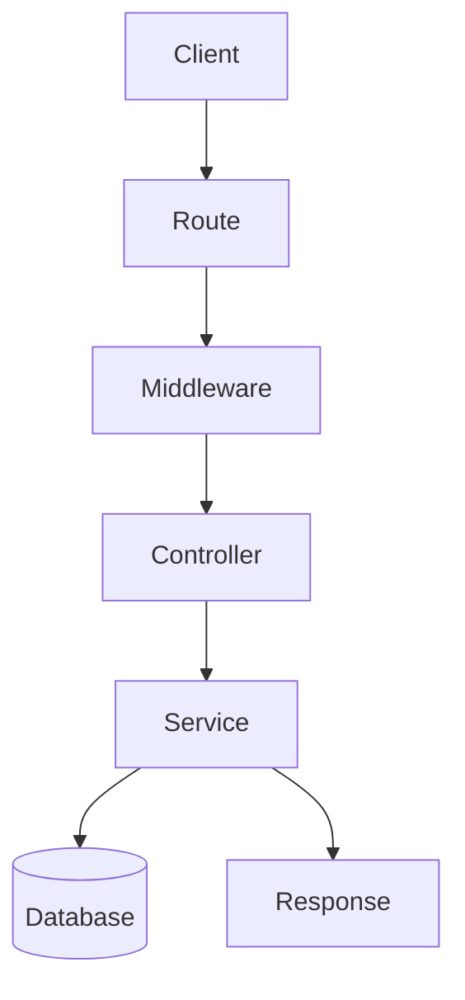

# backend burger content

- the diagram of the backendburger[[backendburgerDiagram]]
- for startup[[bakcedburgerforstatup]]

## Complete notes

Backend burger is a way to imagine backend layers.

- Top bun can be client request.
- Sauce can be routing and middleware.
- Patty can be business logic.
- Cheese can be database layer.
- Bottom bun can be response sent back to client.

## Normal backend flow

1. Client sends request.
2. Server route receives request.
3. Middleware checks auth, validation, or logging.
4. Controller handles the request.
5. Service runs business logic.
6. Database stores or reads data.
7. Server sends response.

## Revision notes

### What it is

Backend layers receive a request, process it, talk to storage, and return a response.

### Why it matters

- It helps you understand the main job of `backend burger content`.
- It gives a mental model for interviews, revision, and building real projects.
- It connects with nearby notes in this vault, so revise it with the content table and related links.

### How to think about it

Ask these questions:

- What problem does it solve?
- What are the main parts?
- What happens step by step?
- Where is it used in real projects?
- What mistake should I avoid?

### Diagram

### Key terms

`route`, `middleware`, `controller`, `service`, `database`

### Real project example

In a real app, `backend burger content` is not learned alone. It connects with frontend, backend, database, browser, network, and deployment decisions.

Example revision flow:

1. Define the topic in one sentence.
2. Draw the flow from memory.
3. Explain one real use case.
4. Say one advantage.
5. Say one limitation or mistake.

### Common mistakes

- Memorizing the word but not knowing the flow.
- Not knowing when to use it.
- Mixing similar topics without comparing them.
- Forgetting the tradeoff.

### Quick revision

- Main idea: Backend layers receive a request, process it, talk to storage, and return a response.
- Remember the keywords: route, middleware, controller, service.
- Best way to revise: explain it out loud with a small example and the diagram.
