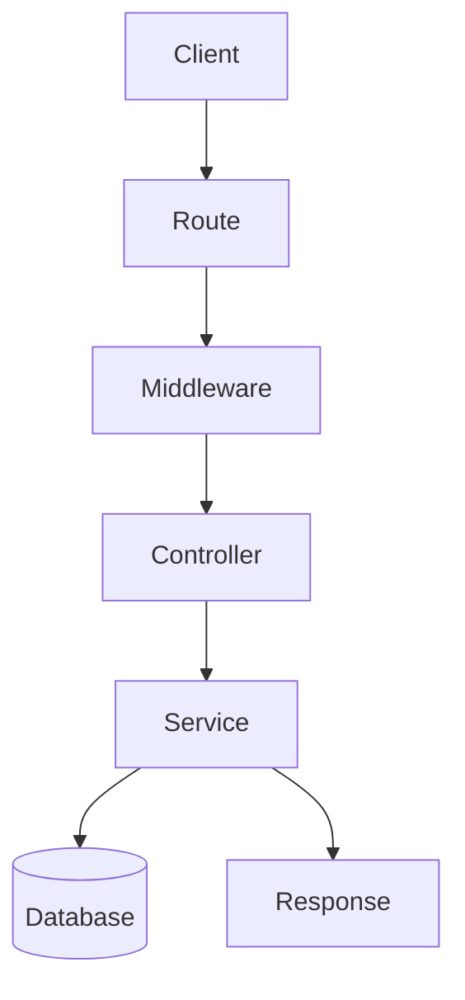

# backendburgerDiagram

![[Pasted image 20260907030045.png]]

## Complete notes

Backend burger diagram should show backend in layers.

## Layers

1. Client
2. API route
3. Middleware
4. Controller
5. Service
6. Database
7. Response

## Simple diagram

```text

Client
  |
API route
  |
Middleware
  |
Controller
  |
Service
  |
Database

```

Each layer has a job.
Keeping layers separate makes backend easier to change and debug.

## Revision notes

### What it is

A backend diagram helps remember how requests move through layers.

### Why it matters

- It helps you understand the main job of `backendburgerDiagram`.
- It gives a mental model for interviews, revision, and building real projects.
- It connects with nearby notes in this vault, so revise it with the content table and related links.

### How to think about it

Ask these questions:

- What problem does it solve?
- What are the main parts?
- What happens step by step?
- Where is it used in real projects?
- What mistake should I avoid?

### Diagram



### Key terms

`client`, `API`, `middleware`, `service`, `database`

### Real project example

In a real app, `backendburgerDiagram` is not learned alone. It connects with frontend, backend, database, browser, network, and deployment decisions.

Example revision flow:

1. Define the topic in one sentence.
2. Draw the flow from memory.
3. Explain one real use case.
4. Say one advantage.
5. Say one limitation or mistake.

### Common mistakes

- Memorizing the word but not knowing the flow.
- Not knowing when to use it.
- Mixing similar topics without comparing them.
- Forgetting the tradeoff.

### Quick revision

- Main idea: A backend diagram helps remember how requests move through layers.
- Remember the keywords: client, API, middleware, service.
- Best way to revise: explain it out loud with a small example and the diagram.
