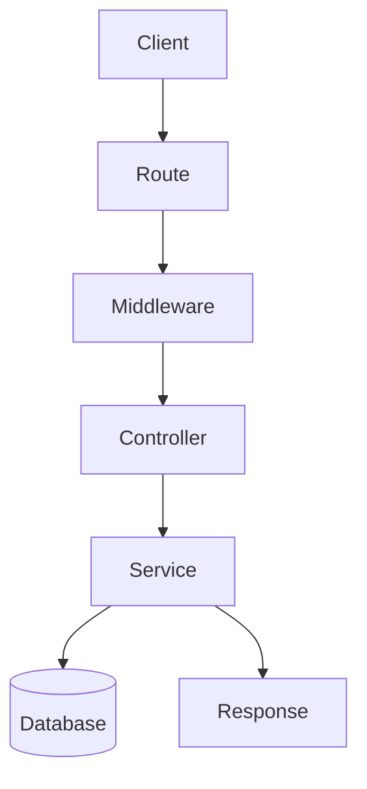

# bakcedburgerforstatup

![[Pasted image 20260907030320.png]]

## Complete notes

For a startup, backend should start simple.

## Good startup backend

- Keep API simple.
- Use clear folder structure.
- Add authentication only where needed.
- Use one database first.
- Add caching only after real performance problem.
- Keep logs for debugging.
- Write basic tests for important flows.

## Avoid early complexity

- Too many microservices.
- Too many queues.
- Too much abstraction.
- Scaling before users exist.

## Simple stack example

Frontend → API server → Database → Logs/[[Monitoring and Alerting|monitoring]]

## Revision notes

### What it is

Startup backend should begin simple and scale when real need appears.

### Why it matters

- It helps you understand the main job of `bakcedburgerforstatup`.
- It gives a mental model for interviews, revision, and building real projects.
- It connects with nearby notes in this vault, so revise it with the content table and related links.

### How to think about it

Ask these questions:

- What problem does it solve?
- What are the main parts?
- What happens step by step?
- Where is it used in real projects?
- What mistake should I avoid?

### Diagram

### Key terms

`MVP`, `[[Monolith and Microservices|monolith]]`, `logs`, `database`, `auth`

### Real project example

In a real app, `bakcedburgerforstatup` is not learned alone. It connects with frontend, backend, database, browser, network, and deployment decisions.

Example revision flow:

1. Define the topic in one sentence.
2. Draw the flow from memory.
3. Explain one real use case.
4. Say one advantage.
5. Say one limitation or mistake.

### Common mistakes

- Memorizing the word but not knowing the flow.
- Not knowing when to use it.
- Mixing similar topics without comparing them.
- Forgetting the tradeoff.

### Quick revision

- Main idea: Startup backend should begin simple and scale when real need appears.
- Remember the keywords: MVP, monolith, logs, database.
- Best way to revise: explain it out loud with a small example and the diagram.
