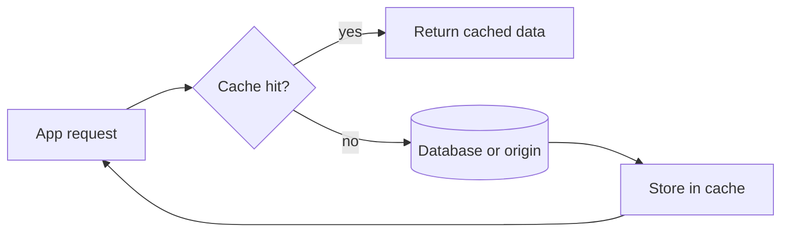

# cache used for

![[Pasted image 20260907024938.png]]

## Complete notes

Cache is used to store frequently used data closer to where it is needed.

## Why cache is used

- To make apps faster.
- To reduce database load.
- To reduce network calls.
- To handle more users with less backend pressure.
- To improve user experience.

## Examples

- Browser caches images, CSS, and JavaScript.
- CDN caches static files near users.
- Redis caches API results or session data.
- CPU cache stores very fast temporary data for the processor.
- Database cache stores repeated query results or pages.

## Important problem

Cache can become stale.
That means the cached data is old while the real data has changed.
So we need TTL, invalidation, or refresh strategy.

## Revision notes

### What it is

Cache is used to reduce repeated work and improve speed.

### Why it matters

- It helps you understand the main job of `cache used for`.
- It gives a mental model for interviews, revision, and building real projects.
- It connects with nearby notes in this vault, so revise it with the content table and related links.

### How to think about it

Ask these questions:

- What problem does it solve?
- What are the main parts?
- What happens step by step?
- Where is it used in real projects?
- What mistake should I avoid?

### Diagram

### Key terms

`latency`, `database load`, `response time`, `throughput`

### Real project example

In a real app, `cache used for` is not learned alone. It connects with frontend, backend, database, browser, network, and deployment decisions.

Example revision flow:

1. Define the topic in one sentence.
2. Draw the flow from memory.
3. Explain one real use case.
4. Say one advantage.
5. Say one limitation or mistake.

### Common mistakes

- Memorizing the word but not knowing the flow.
- Not knowing when to use it.
- Mixing similar topics without comparing them.
- Forgetting the tradeoff.

### Quick revision

- Main idea: Cache is used to reduce repeated work and improve speed.
- Remember the keywords: latency, database load, response time, throughput.
- Best way to revise: explain it out loud with a small example and the diagram.
