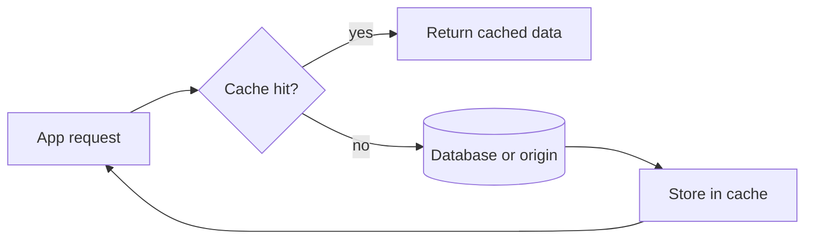

![[Pasted image 20260907025132.png]]

## CDN

it give the data for the static data like img and  video

1st time

![[Pasted image 20260907025253.png]]

2mnd time

![[Pasted image 20260907025318.png]]

## Load Balance

![[Pasted image 20260907025408.png]]

## Kakfa

the message can be [[cache]] for a long period of time based on retention value

![[Pasted image 20260907025440.png]]

## Redis

![[Pasted image 20260907025519.png]]

## Elastic search

![[Pasted image 20260907025544.png]]

## Database level cache

![[Pasted image 20260907025616.png]]

## Revision notes

### What it is

Real cache examples show where [[API Caching with Redis|caching]] appears in daily systems.

### Why it matters

- It helps you understand the main job of `real cache`.
- It gives a mental model for interviews, revision, and building real projects.
- It connects with nearby notes in this vault, so revise it with the content table and related links.

### How to think about it

Ask these questions:

- What problem does it solve?
- What are the main parts?
- What happens step by step?
- Where is it used in real projects?
- What mistake should I avoid?

### Diagram

### Key terms

`browser cache`, `CDN`, `[[what is redis|Redis]]`, `database cache`, `CPU cache`

### Real project example

In a real app, `real cache` is not learned alone. It connects with frontend, backend, database, browser, network, and deployment decisions.

Example revision flow:

1. Define the topic in one sentence.
2. Draw the flow from memory.
3. Explain one real use case.
4. Say one advantage.
5. Say one limitation or mistake.

### Common mistakes

- Memorizing the word but not knowing the flow.
- Not knowing when to use it.
- Mixing similar topics without comparing them.
- Forgetting the tradeoff.

### Quick revision

- Main idea: Real cache examples show where caching appears in daily systems.
- Remember the keywords: browser cache, CDN, Redis, database cache.
- Best way to revise: explain it out loud with a small example and the diagram.
