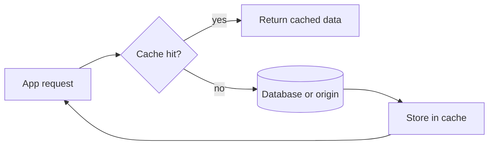

![[Pasted image 20260907024337.png]]

## L1

it is the fastest [[cache]]  it is integrated int the cpu itself so it is fast is has smaller space

## L2

it is slower than the L1 cache it is also stored in the cpu  it is larger that n the L1

## l3

it is slower than the L1 cache it is also stored in the cpu  it is larger that n the L2 used via different cups

# Page cache

![[Pasted image 20260907025008.png]]

the os use this

# File cache

![[Pasted image 20260907025047.png]]

used to access file in the memory

## Revision notes

### What it is

Cache stores frequently used data near the user or app so future access is faster.

### Why it matters

- It helps you understand the main job of `type of cache`.
- It gives a mental model for interviews, revision, and building real projects.
- It connects with nearby notes in this vault, so revise it with the content table and related links.

### How to think about it

Ask these questions:

- What problem does it solve?
- What are the main parts?
- What happens step by step?
- Where is it used in real projects?
- What mistake should I avoid?

### Diagram

### Key terms

`cache hit`, `cache miss`, `TTL`, `invalidation`, `stale data`

### Real project example

In a real app, `type of cache` is not learned alone. It connects with frontend, backend, database, browser, network, and deployment decisions.

Example revision flow:

1. Define the topic in one sentence.
2. Draw the flow from memory.
3. Explain one real use case.
4. Say one advantage.
5. Say one limitation or mistake.

### Common mistakes

- Memorizing the word but not knowing the flow.
- Not knowing when to use it.
- Mixing similar topics without comparing them.
- Forgetting the tradeoff.

### Quick revision

- Main idea: Cache stores frequently used data near the user or app so future access is faster.
- Remember the keywords: cache hit, cache miss, TTL, invalidation.
- Best way to revise: explain it out loud with a small example and the diagram.
