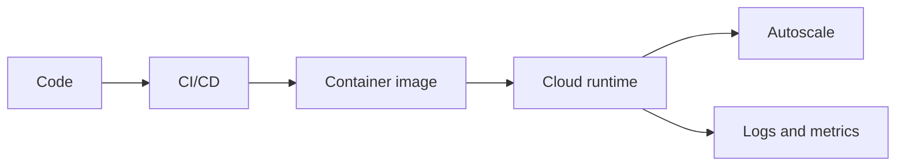

# Cloud computing

running the application on cloud

![[Pasted image 20260907030823.png]]

![[Pasted image 20260907030846.png]]

## Complete notes

Cloud computing means using computing resources over the internet.

Instead of buying physical servers, we rent servers, storage, databases, and services from cloud providers.

## Common cloud providers

- AWS
- Azure
- Google Cloud

## Service models

- IaaS: rent infrastructure like virtual machines.
- PaaS: deploy apps without managing servers deeply.
- SaaS: use complete software over internet.

## Benefits

- Pay as you use.
- Scale up or down.
- Global availability.
- Managed services reduce maintenance.

## Revision notes

### What it is

Cloud computing rents servers, storage, and services over the internet.

### Why it matters

- It helps you understand the main job of `Cloud computing`.
- It gives a mental model for interviews, revision, and building real projects.
- It connects with nearby notes in this vault, so revise it with the content table and related links.

### How to think about it

Ask these questions:

- What problem does it solve?
- What are the main parts?
- What happens step by step?
- Where is it used in real projects?
- What mistake should I avoid?

### Diagram

### Key terms

`IaaS`, `PaaS`, `SaaS`, `region`, `availability`

### Real project example

In a real app, `Cloud computing` is not learned alone. It connects with frontend, backend, database, browser, network, and deployment decisions.

Example revision flow:

1. Define the topic in one sentence.
2. Draw the flow from memory.
3. Explain one real use case.
4. Say one advantage.
5. Say one limitation or mistake.

### Common mistakes

- Memorizing the word but not knowing the flow.
- Not knowing when to use it.
- Mixing similar topics without comparing them.
- Forgetting the tradeoff.

### Quick revision

- Main idea: Cloud computing rents servers, storage, and services over the internet.
- Remember the keywords: IaaS, PaaS, SaaS, region.
- Best way to revise: explain it out loud with a small example and the diagram.
