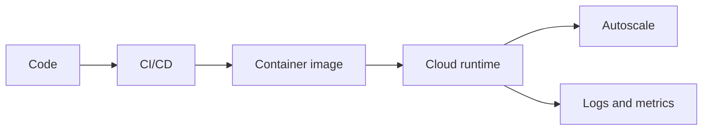

![[Pasted image 20260907030919.png]]

# Achitecture

![[Pasted image 20260907030955.png]]

# Containers

it is a light weight application which contain all the thing s

![[Pasted image 20260907031123.png]]  EXAMPLE

![[Pasted image 20260907031200.png]]

# Devops

![[Pasted image 20260907031248.png]]

## Revision notes

### What it is

Cloud-native pillars are practices that make apps scalable, resilient, and observable.

### Why it matters

- It helps you understand the main job of `Pillars of Cloud Native`.
- It gives a mental model for interviews, revision, and building real projects.
- It connects with nearby notes in this vault, so revise it with the content table and related links.

### How to think about it

Ask these questions:

- What problem does it solve?
- What are the main parts?
- What happens step by step?
- Where is it used in real projects?
- What mistake should I avoid?

### Diagram

### Key terms

`automation`, `resilience`, `observability`, `security`, `scalability`

### Real project example

In a real app, `Pillars of Cloud Native` is not learned alone. It connects with frontend, backend, database, browser, network, and deployment decisions.

Example revision flow:

1. Define the topic in one sentence.
2. Draw the flow from memory.
3. Explain one real use case.
4. Say one advantage.
5. Say one limitation or mistake.

### Common mistakes

- Memorizing the word but not knowing the flow.
- Not knowing when to use it.
- Mixing similar topics without comparing them.
- Forgetting the tradeoff.

### Quick revision

- Main idea: Cloud-native pillars are practices that make apps scalable, resilient, and observable.
- Remember the keywords: automation, resilience, observability, security.
- Best way to revise: explain it out loud with a small example and the diagram.
