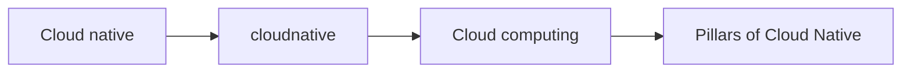

# cloud native content table

- what is cloud native[[cloudnative]]
- cloud computing [[ Cloud computing ]]
- Pillars of Cloud Native [[Pillars of Cloud Native ]]

![[Pasted image 20260907030658.png]]

![[Pasted image 20260907031431.png]]

## Complete notes

Cloud native topic map:

- [[cloudnative]] explains cloud-native app idea.
- [[Cloud computing]] explains cloud basics.
- [[Pillars of Cloud Native]] explains important principles.

## Must know

- Cloud native is about automation, scalability, and reliability.
- Containers make deployment consistent.
- Observability helps detect and debug problems.
- CI/CD makes release process faster.

## Revision dashboard

### Main idea

Cloud native apps are built for automation, scaling, resilience, and observability.

### Study order

- [[cloudnative]]
- [[Cloud computing]]
- [[Pillars of Cloud Native]]

### Diagram

### How to revise this folder

1. Open this content table first.
2. Click each linked topic one by one.
3. Read the `Complete notes` and `Revision notes` sections.
4. Redraw the diagram from memory.
5. Explain one real example without looking.

### Revision checklist

- I can define Cloud native in one sentence.
- I can explain each linked note.
- I can draw the topic flow.
- I know one use case.
- I know one common mistake.
