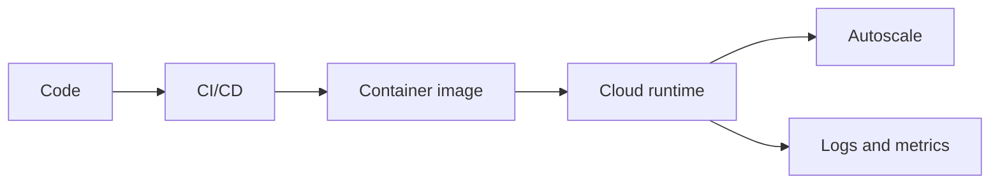

# cloudnative

it is building web scalable application on cloud which is more scalable and more available

## Complete notes

Cloud native means building apps to run well in cloud environments.

## Main idea

The app should be easy to deploy, scale, monitor, and recover.

## Common parts

- Containers.
- Microservices.
- CI/CD.
- Observability.
- Autoscaling.
- Managed cloud services.

## Example

Instead of installing everything on one server, we package the app in containers and run it on cloud infrastructure.

## Benefit

Cloud native apps can handle change better because they are built for automation and scaling.

## Revision notes

### What it is

Cloud native apps are designed for cloud deployment, scaling, and recovery.

### Why it matters

- It helps you understand the main job of `cloudnative`.
- It gives a mental model for interviews, revision, and building real projects.
- It connects with nearby notes in this vault, so revise it with the content table and related links.

### How to think about it

Ask these questions:

- What problem does it solve?
- What are the main parts?
- What happens step by step?
- Where is it used in real projects?
- What mistake should I avoid?

### Diagram

### Key terms

`container`, `CI/CD`, `observability`, `autoscaling`

### Real project example

In a real app, `cloudnative` is not learned alone. It connects with frontend, backend, database, browser, network, and deployment decisions.

Example revision flow:

1. Define the topic in one sentence.
2. Draw the flow from memory.
3. Explain one real use case.
4. Say one advantage.
5. Say one limitation or mistake.

### Common mistakes

- Memorizing the word but not knowing the flow.
- Not knowing when to use it.
- Mixing similar topics without comparing them.
- Forgetting the tradeoff.

### Quick revision

- Main idea: Cloud native apps are designed for cloud deployment, scaling, and recovery.
- Remember the keywords: container, CI/CD, observability, autoscaling.
- Best way to revise: explain it out loud with a small example and the diagram.
