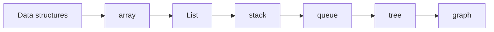

# Data structure content table

- List[[List]]
- Array [[array]]
- Stacks[[stack]]
- Queue[[queue]]
- heaps[[heaps]]
- tree[[tree]]
- hash table [[hash table]]
- syfix tree[[sufux tree]]
- graph[[graph]]
- Cache[[cache]]

![[Pasted image 20260907023008.png]]

## Complete notes

Data structure topic map:

- [[array]] stores indexed values.
- [[List]] stores ordered values.
- [[stack]] follows LIFO.
- [[queue]] follows FIFO.
- [[tree]] stores hierarchy.
- [[graph]] stores connected nodes.
- [[hash table]] stores key-value data.
- [[heaps]] handles priority.
- [[cache]] stores repeated data for speed.
- [[sufux tree]] helps string searching.

## Must know

Choose data structure based on access, insert, delete, search, and memory needs.

## Revision dashboard

### Main idea

Data structures organize data so programs can access and change it efficiently.

### Study order

- [[array]]
- [[List]]
- [[stack]]
- [[queue]]
- [[tree]]
- [[graph]]
- [[hash table]]
- [[heaps]]
- [[cache]]
- [[sufux tree]]

### Diagram

### How to revise this folder

1. Open this content table first.
2. Click each linked topic one by one.
3. Read the `Complete notes` and `Revision notes` sections.
4. Redraw the diagram from memory.
5. Explain one real example without looking.

### Revision checklist

- I can define Data structures in one sentence.
- I can explain each linked note.
- I can draw the topic flow.
- I know one use case.
- I know one common mistake.
