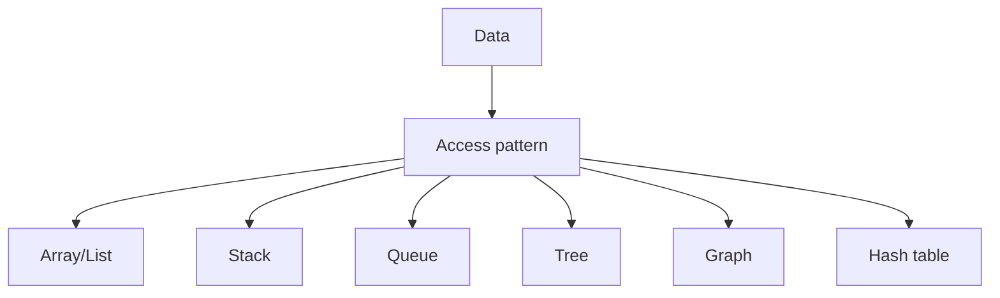

## used in

- task managment
- social media manager

-

## Complete notes

List stores values in sequence.

In many languages list is dynamic, so it can grow and shrink.

## Array list

- Uses array internally.
- Fast access by index.
- Insert/delete in middle can be slower.

## Linked list

- Uses nodes.
- Each node points to the next node.
- Insert/delete can be easier if node position is known.
- Access by index is slower.

## Use when

Use list when you need a group of items that can change over time.

## Revision notes

### What it is

List stores a sequence of values and can grow or shrink.

### Why it matters

- It helps you understand the main job of `List`.
- It gives a mental model for interviews, revision, and building real projects.
- It connects with nearby notes in this vault, so revise it with the content table and related links.

### How to think about it

Ask these questions:

- What problem does it solve?
- What are the main parts?
- What happens step by step?
- Where is it used in real projects?
- What mistake should I avoid?

### Diagram

### Key terms

`array list`, `linked list`, `node`, `head`, `tail`

### Real project example

In a real app, `List` is not learned alone. It connects with frontend, backend, database, browser, network, and deployment decisions.

Example revision flow:

1. Define the topic in one sentence.
2. Draw the flow from memory.
3. Explain one real use case.
4. Say one advantage.
5. Say one limitation or mistake.

### Common mistakes

- Memorizing the word but not knowing the flow.
- Not knowing when to use it.
- Mixing similar topics without comparing them.
- Forgetting the tradeoff.

### Quick revision

- Main idea: List stores a sequence of values and can grow or shrink.
- Remember the keywords: array list, linked list, node, head.
- Best way to revise: explain it out loud with a small example and the diagram.
