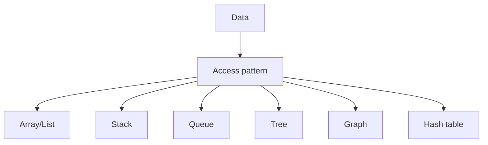

Fixed size colection

## used for

![[Pasted image 20260902152313.png]]

Image processing

## Complete notes

Array stores multiple values in continuous order.

Each value has an index.
Index usually starts from `0`.

## Example

```js

const nums = [10, 20, 30];
console.log(nums[0]); // 10

```

## Good points

- Fast access by index.
- Easy to loop.
- Good when size/order matters.

## Weak points

- Insert/delete in middle can be slow.
- Fixed-size arrays in some languages cannot grow easily.

## Revision notes

### What it is

Array stores ordered values and gives fast access by index.

### Why it matters

- It helps you understand the main job of `array`.
- It gives a mental model for interviews, revision, and building real projects.
- It connects with nearby notes in this vault, so revise it with the content table and related links.

### How to think about it

Ask these questions:

- What problem does it solve?
- What are the main parts?
- What happens step by step?
- Where is it used in real projects?
- What mistake should I avoid?

### Diagram



### Key terms

`index`, `length`, `iteration`, `insert`, `delete`

### Real project example

In a real app, `array` is not learned alone. It connects with frontend, backend, database, browser, network, and deployment decisions.

Example revision flow:

1. Define the topic in one sentence.
2. Draw the flow from memory.
3. Explain one real use case.
4. Say one advantage.
5. Say one limitation or mistake.

### Common mistakes

- Memorizing the word but not knowing the flow.
- Not knowing when to use it.
- Mixing similar topics without comparing them.
- Forgetting the tradeoff.

### Quick revision

- Main idea: Array stores ordered values and gives fast access by index.
- Remember the keywords: index, length, iteration, insert.
- Best way to revise: explain it out loud with a small example and the diagram.
