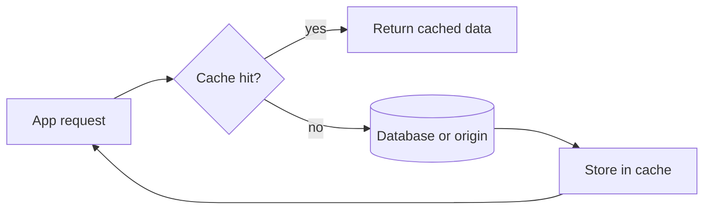

# cache

![[Pasted image 20260907022833.png]]

## Complete notes

Cache in data structures means storing frequently used data for fast access.

## Example

If a program calculates a result again and again, we can store the answer once.
Next time we use the stored answer.

## Common strategies

- LRU means Least Recently Used.
- LFU means Least Frequently Used.
- FIFO removes the oldest item first.

## Use cases

- Browser cache.
- Database query cache.
- API response cache.
- Dynamic programming memoization.

## Revision notes

### What it is

Cache is a data structure/system pattern for remembering expensive results.

### Why it matters

- It helps you understand the main job of `cache`.
- It gives a mental model for interviews, revision, and building real projects.
- It connects with nearby notes in this vault, so revise it with the content table and related links.

### How to think about it

Ask these questions:

- What problem does it solve?
- What are the main parts?
- What happens step by step?
- Where is it used in real projects?
- What mistake should I avoid?

### Diagram

### Key terms

`LRU`, `LFU`, `memoization`, `eviction`, `TTL`

### Real project example

In a real app, `cache` is not learned alone. It connects with frontend, backend, database, browser, network, and deployment decisions.

Example revision flow:

1. Define the topic in one sentence.
2. Draw the flow from memory.
3. Explain one real use case.
4. Say one advantage.
5. Say one limitation or mistake.

### Common mistakes

- Memorizing the word but not knowing the flow.
- Not knowing when to use it.
- Mixing similar topics without comparing them.
- Forgetting the tradeoff.

### Quick revision

- Main idea: Cache is a data structure/system pattern for remembering expensive results.
- Remember the keywords: LRU, LFU, memoization, eviction.
- Best way to revise: explain it out loud with a small example and the diagram.
