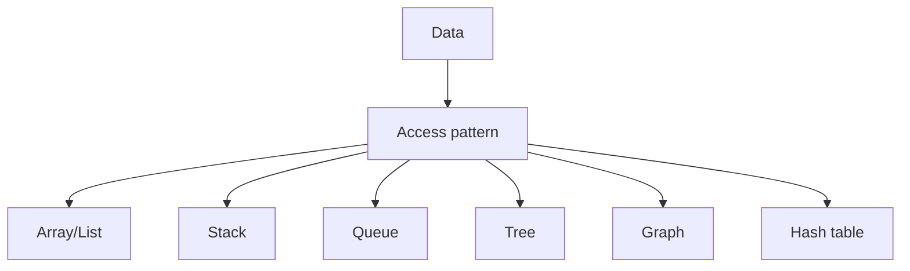

# graph

it is all about  tracking relationship

![[Pasted image 20260907022744.png]]

used in recomendation engine

![[Pasted image 20260907022805.png]]

## Complete notes

Graph is a data structure made of nodes and edges.

Node is also called vertex.
Edge is the connection between nodes.

## Types

- Directed graph: edge has direction.
- Undirected graph: edge has no direction.
- Weighted graph: edge has cost or weight.
- Unweighted graph: edge has no cost.

## Examples

- Google Maps roads.
- Social media friends.
- Computer networks.
- Recommendation systems.

## Common algorithms

- BFS
- DFS
- Dijkstra

## Revision notes

### What it is

Graph stores nodes and connections between them.

### Why it matters

- It helps you understand the main job of `graph`.
- It gives a mental model for interviews, revision, and building real projects.
- It connects with nearby notes in this vault, so revise it with the content table and related links.

### How to think about it

Ask these questions:

- What problem does it solve?
- What are the main parts?
- What happens step by step?
- Where is it used in real projects?
- What mistake should I avoid?

### Diagram

### Key terms

`vertex`, `edge`, `directed`, `weighted`, `BFS`, `DFS`

### Real project example

In a real app, `graph` is not learned alone. It connects with frontend, backend, database, browser, network, and deployment decisions.

Example revision flow:

1. Define the topic in one sentence.
2. Draw the flow from memory.
3. Explain one real use case.
4. Say one advantage.
5. Say one limitation or mistake.

### Common mistakes

- Memorizing the word but not knowing the flow.
- Not knowing when to use it.
- Mixing similar topics without comparing them.
- Forgetting the tradeoff.

### Quick revision

- Main idea: Graph stores nodes and connections between them.
- Remember the keywords: vertex, edge, directed, weighted.
- Best way to revise: explain it out loud with a small example and the diagram.
