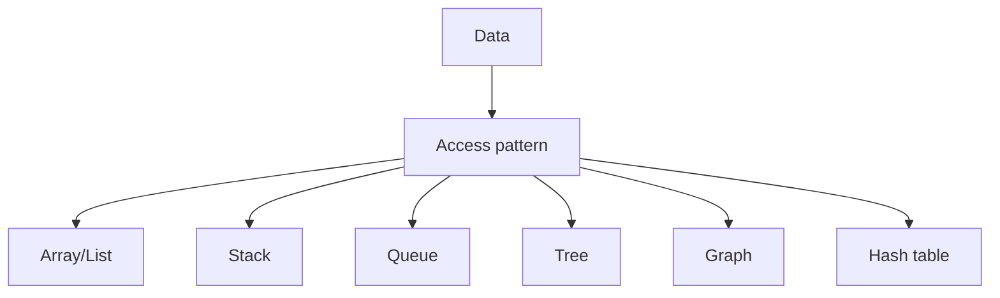

# hash table

used for insertion and deletion

![[Pasted image 20260902154325.png]]

![[Pasted image 20260902154339.png]]

used in

- search engine
- cachig system
- ![[Pasted image 20260902154413.png]]

## Complete notes

Hash table stores data as key-value pairs.

## Example

```js

const user = {
  name: "Priyanshu",
  age: 20
};

```

Here `name` and `age` are keys.

## Why it is fast

A hash function converts the key into an index.
Then data can be found quickly.

## Collision

Collision happens when two keys produce the same place.
Hash tables handle this using techniques like chaining or open addressing.

## Use cases

- Objects/maps.
- Caches.
- Counting frequency.
- Fast lookup.

## Revision notes

### What it is

Hash table stores key-value data and gives fast lookup.

### Why it matters

- It helps you understand the main job of `hash table`.
- It gives a mental model for interviews, revision, and building real projects.
- It connects with nearby notes in this vault, so revise it with the content table and related links.

### How to think about it

Ask these questions:

- What problem does it solve?
- What are the main parts?
- What happens step by step?
- Where is it used in real projects?
- What mistake should I avoid?

### Diagram



### Key terms

`key`, `value`, `hash function`, `collision`, `map`

### Real project example

In a real app, `hash table` is not learned alone. It connects with frontend, backend, database, browser, network, and deployment decisions.

Example revision flow:

1. Define the topic in one sentence.
2. Draw the flow from memory.
3. Explain one real use case.
4. Say one advantage.
5. Say one limitation or mistake.

### Common mistakes

- Memorizing the word but not knowing the flow.
- Not knowing when to use it.
- Mixing similar topics without comparing them.
- Forgetting the tradeoff.

### Quick revision

- Main idea: Hash table stores key-value data and gives fast lookup.
- Remember the keywords: key, value, hash function, collision.
- Best way to revise: explain it out loud with a small example and the diagram.
