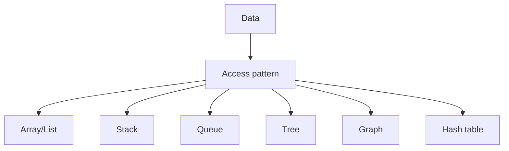

used for task management and memory management

## used for

![[Pasted image 20260902152656.png]]

min heap. and max heap

![[Pasted image 20260902152718.png]]

## Complete notes

Heap is a tree-based data structure.

It is usually used to get the minimum or maximum value quickly.

## Min heap

The smallest value stays at the top.

## Max heap

The largest value stays at the top.

## Use cases

- Priority queue.
- Scheduling jobs.
- Finding top K items.
- Dijkstra shortest path algorithm.

## Important point

Heap is not fully sorted.
It only keeps the highest priority item easy to access.

## Revision notes

### What it is

Heap keeps highest or lowest priority value easy to access.

### Why it matters

- It helps you understand the main job of `heaps`.
- It gives a mental model for interviews, revision, and building real projects.
- It connects with nearby notes in this vault, so revise it with the content table and related links.

### How to think about it

Ask these questions:

- What problem does it solve?
- What are the main parts?
- What happens step by step?
- Where is it used in real projects?
- What mistake should I avoid?

### Diagram

### Key terms

`min heap`, `max heap`, `priority [[Message Queue with Redis|queue]]`, `top K`

### Real project example

In a real app, `heaps` is not learned alone. It connects with frontend, backend, database, browser, network, and deployment decisions.

Example revision flow:

1. Define the topic in one sentence.
2. Draw the flow from memory.
3. Explain one real use case.
4. Say one advantage.
5. Say one limitation or mistake.

### Common mistakes

- Memorizing the word but not knowing the flow.
- Not knowing when to use it.
- Mixing similar topics without comparing them.
- Forgetting the tradeoff.

### Quick revision

- Main idea: Heap keeps highest or lowest priority value easy to access.
- Remember the keywords: min heap, max heap, priority queue, top K.
- Best way to revise: explain it out loud with a small example and the diagram.
