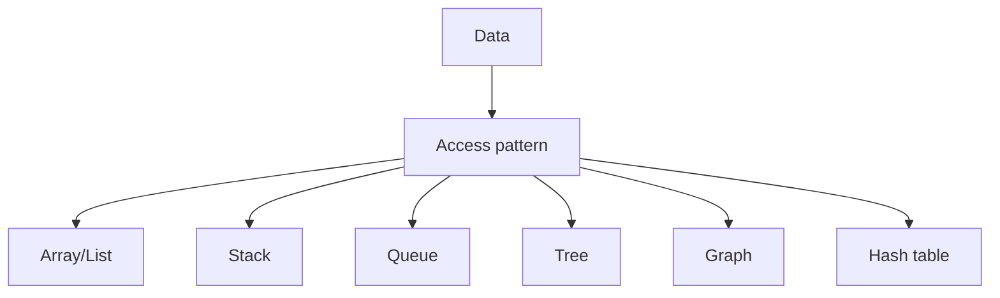

first in first out

## used in

chat applications
sending mesage

![[Pasted image 20260902152522.png]]

chat app

![[Pasted image 20260902152601.png]]

## Complete notes

Queue is a linear data structure.

It follows FIFO.

FIFO means First In First Out.

## Main operations

- `enqueue` adds item at the back.
- `dequeue` removes item from the front.
- `front` checks the first item.

## Real life example

A line at a ticket counter.
The person who comes first gets served first.

## Use cases

- Printer queue.
- Task scheduling.
- Message queues.
- BFS graph traversal.

## Revision notes

### What it is

Queue follows First In First Out, so the oldest item is removed first.

### Why it matters

- It helps you understand the main job of `queue`.
- It gives a mental model for interviews, revision, and building real projects.
- It connects with nearby notes in this vault, so revise it with the content table and related links.

### How to think about it

Ask these questions:

- What problem does it solve?
- What are the main parts?
- What happens step by step?
- Where is it used in real projects?
- What mistake should I avoid?

### Diagram

### Key terms

`enqueue`, `dequeue`, `front`, `FIFO`, `scheduler`

### Real project example

In a real app, `queue` is not learned alone. It connects with frontend, backend, database, browser, network, and deployment decisions.

Example revision flow:

1. Define the topic in one sentence.
2. Draw the flow from memory.
3. Explain one real use case.
4. Say one advantage.
5. Say one limitation or mistake.

### Common mistakes

- Memorizing the word but not knowing the flow.
- Not knowing when to use it.
- Mixing similar topics without comparing them.
- Forgetting the tradeoff.

### Quick revision

- Main idea: Queue follows First In First Out, so the oldest item is removed first.
- Remember the keywords: enqueue, dequeue, front, FIFO.
- Best way to revise: explain it out loud with a small example and the diagram.
