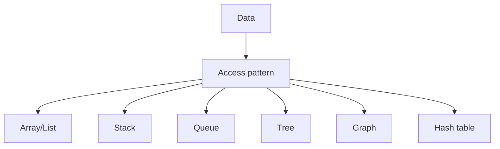

last in first out

## used for

undo and redo application

![[Pasted image 20260902152356.png]]

## Complete notes

Stack is a linear data structure.

It follows LIFO.

LIFO means Last In First Out.

## Main operations

- `push` adds an item on top.
- `pop` removes the top item.
- `peek` checks the top item without removing it.

## Real life example

Think about plates stacked on each other.
The last plate kept on top is removed first.

## Use cases

- Undo and redo.
- Browser history.
- Function call stack.
- Valid parenthesis checking.

## Revision notes

### What it is

Stack follows Last In First Out, so the newest item is removed first.

### Why it matters

- It helps you understand the main job of `stack`.
- It gives a mental model for interviews, revision, and building real projects.
- It connects with nearby notes in this vault, so revise it with the content table and related links.

### How to think about it

Ask these questions:

- What problem does it solve?
- What are the main parts?
- What happens step by step?
- Where is it used in real projects?
- What mistake should I avoid?

### Diagram

### Key terms

`push`, `pop`, `peek`, `LIFO`, `call stack`

### Real project example

In a real app, `stack` is not learned alone. It connects with frontend, backend, database, browser, network, and deployment decisions.

Example revision flow:

1. Define the topic in one sentence.
2. Draw the flow from memory.
3. Explain one real use case.
4. Say one advantage.
5. Say one limitation or mistake.

### Common mistakes

- Memorizing the word but not knowing the flow.
- Not knowing when to use it.
- Mixing similar topics without comparing them.
- Forgetting the tradeoff.

### Quick revision

- Main idea: Stack follows Last In First Out, so the newest item is removed first.
- Remember the keywords: push, pop, peek, LIFO.
- Best way to revise: explain it out loud with a small example and the diagram.
