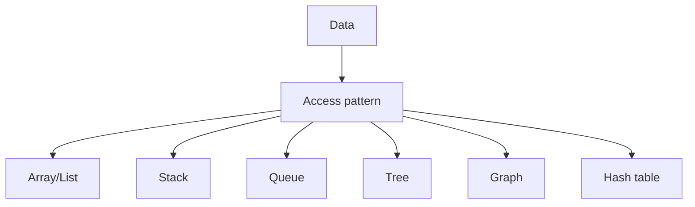

# sufux tree

used for text editors

![[Pasted image 20260902154523.png]]

## Complete notes

Suffix tree is a tree used for string searching.

It stores all suffixes of a string.

## Why it is useful

After building the tree, we can search patterns very fast.

## Example idea

For `banana`, suffixes are:

- `banana`
- `anana`
- `nana`
- `ana`
- `na`
- `a`

## Use cases

- Text search.
- DNA sequence matching.
- Finding repeated substrings.
- Pattern matching.

## Note

Suffix tree is powerful but complex.
For beginner understanding, remember it is made to search inside strings quickly.

## Revision notes

### What it is

Suffix tree stores suffixes of a string for fast pattern search.

### Why it matters

- It helps you understand the main job of `Suffix tree`.
- It gives a mental model for interviews, revision, and building real projects.
- It connects with nearby notes in this vault, so revise it with the content table and related links.

### How to think about it

Ask these questions:

- What problem does it solve?
- What are the main parts?
- What happens step by step?
- Where is it used in real projects?
- What mistake should I avoid?

### Diagram

### Key terms

`suffix`, `substring`, `pattern matching`, `text search`

### Real project example

In a real app, `Suffix tree` is not learned alone. It connects with frontend, backend, database, browser, network, and deployment decisions.

Example revision flow:

1. Define the topic in one sentence.
2. Draw the flow from memory.
3. Explain one real use case.
4. Say one advantage.
5. Say one limitation or mistake.

### Common mistakes

- Memorizing the word but not knowing the flow.
- Not knowing when to use it.
- Mixing similar topics without comparing them.
- Forgetting the tradeoff.

### Quick revision

- Main idea: Suffix tree stores suffixes of a string for fast pattern search.
- Remember the keywords: suffix, substring, pattern matching, text search.
- Best way to revise: explain it out loud with a small example and the diagram.
